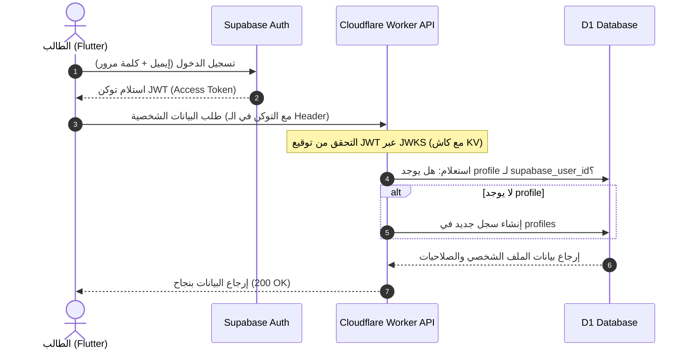
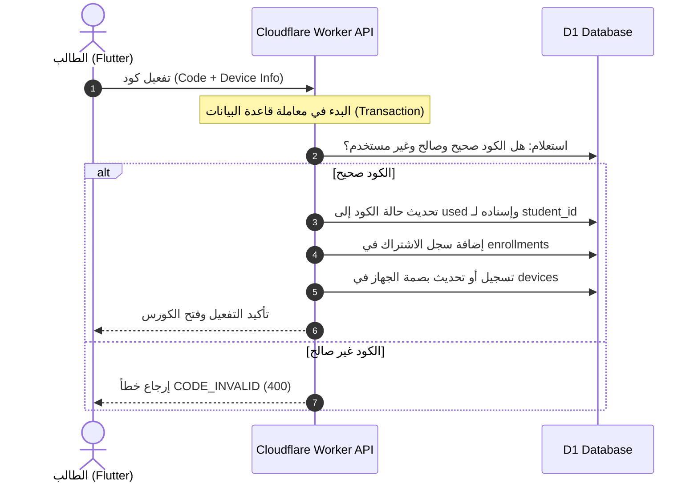
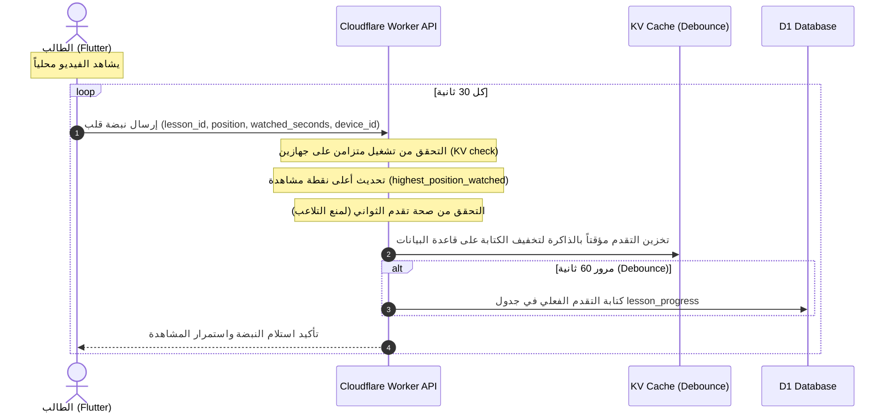

# 03 — المعمارية العامة

## 🧱 المكوّنات الرئيسية

| المكوّن | التقنية | الدور |
|---|---|---|
| تطبيق الطلاب | Flutter (Android/iOS) | واجهة الطالب + المشغّل المحمي |
| لوحة المدرس | Next.js على Cloudflare Pages | إدارة المحتوى والطلاب |
| الـ API | Cloudflare Workers (Hono) | منطق العمل + الصلاحيات + توقيع الروابط |
| قاعدة البيانات | Cloudflare D1 (SQLite) | كل بيانات التطبيق |
| تخزين الملفات | Cloudflare R2 | PDF/صور/مرفقات/أغلفة |
| ترميز الفيديو | Bunny Stream | ترميز سحابي للجودات (480p/720p/1080p) |
| بث الفيديو | Cloudflare R2 | تخزين شرائح HLS المشفّرة وبثّها المحمي |
| الكاش/الحالة | Cloudflare KV | كاش، Rate limiting، تخزين توكنات مؤقتة |
| المهام غير المتزامنة | Cloudflare Queues | الإشعارات، معالجة Webhooks |
| المهام المجدولة | Cron Triggers | تنظيف، تقارير، انتهاء الأكواد |
| المصادقة | Supabase Auth | تسجيل/دخول/JWT/استرجاع كلمة المرور |

> **مبدأ أساسي:** Supabase مسؤول عن **المصادقة فقط**. كل بيانات التطبيق (الكورسات،
> الطلاب، الأكواد، الأسئلة...) تعيش في **Cloudflare D1**. الربط بينهما عبر
> `supabase_user_id` المخزّن في جدول `profiles` داخل D1.

---

## 🗺️ مخطط المعمارية

```
┌────────────────────────────────────────────────────────────────────────────┐
│                              العملاء (Clients)                              │
│                                                                            │
│   ┌───────────────────────────┐        ┌───────────────────────────────┐   │
│   │   تطبيق الطلاب (Flutter)   │        │   لوحة المدرس (Next.js/Pages)  │   │
│   │   - Supabase Auth SDK     │        │   - Supabase Auth SDK          │   │
│   │   - مشغّل HLS + حماية      │        │   - رفع مباشر للفيديو/الملفات   │   │
│   └────────────┬──────────────┘        └────────────────┬──────────────┘   │
└────────────────┼──────────────────────────────────────┼──────────────────┘
                 │                                        │
        (1) تسجيل دخول                             (1) تسجيل دخول
                 │   ┌──────────────────────────┐        │
                 └──►│      Supabase Auth        │◄───────┘
                     │  JWT (access/refresh)     │
                     └──────────────────────────┘
                 │                                        │
        (2) طلب API + Bearer JWT                 (2) طلب API + Bearer JWT
                 │                                        │
                 ▼                                        ▼
┌────────────────────────────────────────────────────────────────────────────┐
│                  Cloudflare Worker API (Hono)                              │
│             api.dr-physics.synapticstudio.tech                            │
│                                                                            │
│   • التحقق من JWT (عبر Supabase JWKS)   • فرض الأدوار/الصلاحيات (RBAC)      │
│   • منطق العمل (Courses/Lessons/Codes)  • توقيع روابط البث (Stream tokens)  │
│   • Rate limiting + Audit               • توليد روابط رفع مباشر (R2/Stream) │
└───┬──────────┬───────────┬─────────────┬──────────────┬────────────────────┘
    │          │           │             │              │
    ▼          ▼           ▼             ▼              ▼
┌────────┐ ┌────────┐ ┌──────────┐ ┌──────────┐ ┌───────────────┐
│   D1   │ │   R2   │ │  Stream  │ │    KV    │ │    Queues     │
│ بيانات │ │ ملفات  │ │ فيديوهات │ │ كاش/توكن │ │ إشعارات/أحداث │
└────────┘ └────────┘ └──────────┘ └──────────┘ └───────┬───────┘
                                                        │
                                                        ▼
                                            ┌────────────────────────┐
                                            │  FCM (Android) / APNs  │
                                            │      إشعارات Push      │
                                            └────────────────────────┘
```

---

## 🔄 تدفّقات أساسية (Flows)

### 1) تسجيل الدخول والتفويض
```
الطالب → Supabase (إيميل/باسورد) → يستلم JWT
الطالب → API + Authorization: Bearer <JWT>
API → يتحقق من توقيع JWT عبر Supabase JWKS (مع كاش في KV)
API → يقرأ user_id من التوكن → يجلب/ينشئ profile في D1 → يطبّق الصلاحيات
```

### 2) رفع فيديو من لوحة المدرس
```
المدرس → API: «أريد رفع فيديو» (مع التحقق من دور admin)
API → Bunny Stream: ينشئ كائن فيديو ويولّد توقيع رفع TUS
API → يرجّع رابط رفع TUS للمتصفح + يسجّل الفيديو في D1 بحالة uploading
المتصفح → يرفع الملف مباشرة إلى Bunny Stream (لا يمر بالـ Worker)
API → عند اكتمال الرفع يضع مهمة في Queues لمتابعة الترميز
Queue Consumer → يستطلع حالة الترميز في Bunny ثم ينقل شرائح HLS إلى R2 مشفّرة بـ AES-128
Queue Consumer → يحدّث D1 (provider=r2_hls, status=ready) ويحذف النسخة من Bunny لتوفير التخزين
```

### 3) مشاهدة فيديو محمي
```
الطالب → API: «أعطني رابط تشغيل الدرس X»
API → يتحقق: هل الطالب مفعّل لهذا الكورس؟ هل الجهاز موثّق؟
API → يولّد توكن تشغيل موقّع (JWT) مربوط بالجهاز والـ IP و User-Agent
       + يسجّل الجلسة النشطة في KV + بيانات العلامة المائية
API → يرجّع رابط قائمة تشغيل HLS يمر عبر الـ Worker
التطبيق → يشغّل HLS عبر مشغّل آمن (FLAG_SECURE + علامة مائية ديناميكية)
       ومفتاح فك التشفير يُطلَب بتوكن منفصل قصير الصلاحية
```

### 4) تفعيل كود
```
الطالب → API: «فعّل الكود ABC-123»
API → يقفل الصف (transaction) → يتحقق: موجود؟ غير مستخدم؟ غير منتهٍ؟
API → ينشئ enrollment (طالب ↔ كورس) + يعلّم الكود مستخدمًا (used_by, used_at)
API → يرجّع تأكيد + يفتح الكورس للطالب
```

---

## 🧩 لماذا هذا التقسيم؟

- **Supabase للمصادقة:** نظام مصادقة جاهز وآمن (تحقق إيميل، استرجاع كلمة مرور، إدارة
  الجلسات) دون إعادة اختراع العجلة، مع SDK ممتاز لـ Flutter وللويب.
- **D1 لكل البيانات:** قريبة من الـ Worker (زمن استجابة منخفض)، رخيصة، وتبقي ملكية
  البيانات كاملة على Cloudflare كما طُلب.
- **R2 للملفات:** بدون رسوم Egress، مثالي للـ PDF والصور.
- **Stream للفيديو:** يوفّر معالجة تلقائية، HLS متكيّف، روابط موقّعة، و DRM — وهو جوهر
  الحماية المطلوبة.
- **KV:** كاش لمفاتيح JWKS، تخزين Nonce/توكنات مؤقتة، عدّادات Rate limit.
- **Queues + Cron:** فصل المهام البطيئة (إشعارات، تنظيف الأكواد المنتهية).

---

## 🌐 توزيع النطاقات والبيئات

| البيئة | Dashboard | API |
|---|---|---|
| Production | `dr-physics.synapticstudio.tech` | `api.dr-physics.synapticstudio.tech` |
| Staging | `staging.dr-physics.synapticstudio.tech` | `api-staging.dr-physics.synapticstudio.tech` |

> التطبيق (الموبايل) يحمل عنوان الـ API كمتغيّر بيئة (Production/Staging build flavors).

---

## 🧷 مبادئ معمارية ملزمة

1. **لا يصل العميل لقاعدة البيانات مباشرة** — كل شيء عبر الـ Worker API.
2. **لا تُكشف مفاتيح Stream/R2/Service keys** للعميل إطلاقًا — التوقيع داخل الـ Worker.
3. **روابط البث قصيرة الصلاحية دائمًا** ولا تُخزَّن.
4. **كل طلب يكتب/يعدّل يتطلّب تحقق دور صريح** (RBAC) داخل الـ Worker.
5. **فصل الاهتمامات:** Supabase = هوية، D1 = بيانات، Stream/R2 = وسائط.

---

## ⏱️ مخططات التسلسل الزمني للتفاعلات (Sequence Diagrams)

### 1) التحقق من الهوية ومزامنة الملف التعريفي (Auth Flow)


### 2) تفعيل كود وتوثيق الجهاز (Code Activation & Device Binding)


### 3) تدفق تتبع تقدم الدرس ونبضات القلب (Lesson Progress Heartbeat)


---

التالي: [04 — الستاك التقني](./04-tech-stack.md)
