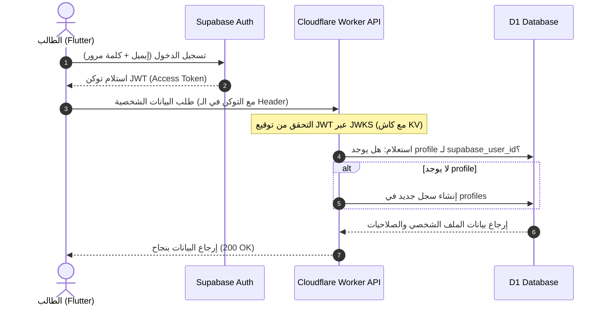
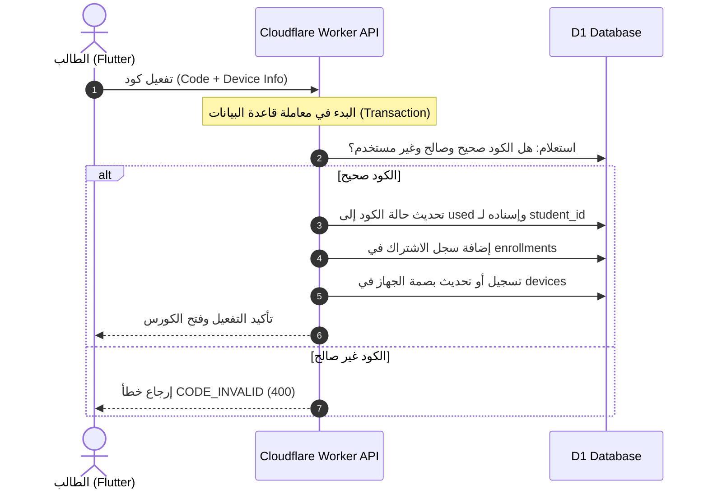
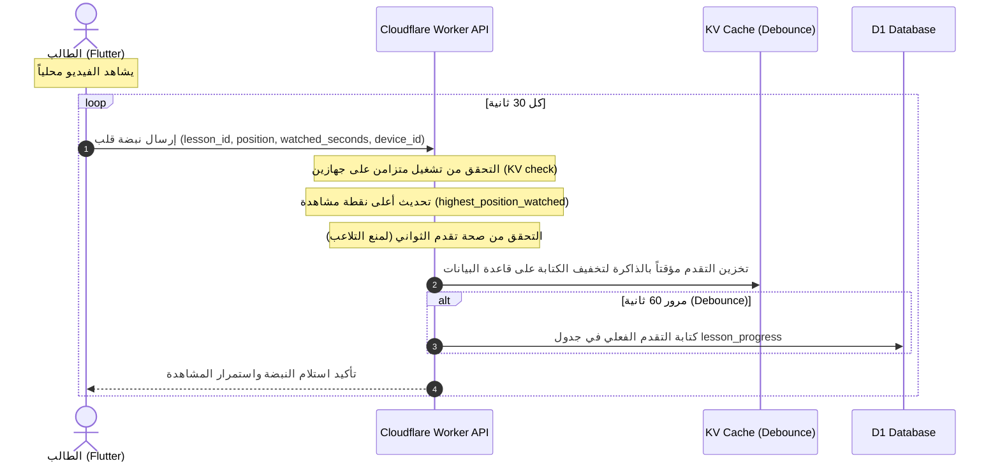

# 🎓 التوثيق الشامل والمتكامل — منصة الدكتور في الفيزياء

> يحتوي هذا الملف على كافة وثائق التصميم والمواصفات المعمارية والهيكلية لمنصة "الدكتور في الفيزياء" التعليمية بشكل كامل وتفصيلي دون أي اختصار، متضمناً التحسينات والتصحيحات الأمنية والتشغيلية الأخيرة.

---

<!-- START OF 00-env-reference.md -->

# 00 — مرجع متغيرات البيئة (Environment Variables Reference)

يوضح هذا الملف جميع متغيرات البيئة والأسرار (Secrets) المطلوبة لتشغيل كلاً من الـ API (Workers)، لوحة التحكم (Pages)، وتطبيق الموبايل (Flutter).

---

## ⚙️ 1. الـ API الخلفي (Cloudflare Workers)

تُقسم المتغيرات هنا إلى متغيرات عادية (Variables) تُكتب في `wrangler.toml` وأسرار مشفرة (Secrets) تُحفظ عبر سطر الأوامر.

### المتغيرات العامة (Environment Variables)
| المتغير | النوع | الوصف | مثال |
|---|---|---|---|
| `SUPABASE_URL` | String | رابط مشروع Supabase الخاص بك | `https://oaeivekclvx.supabase.co` |
| `JWT_AUDIENCE` | String | نوع توجيه التوكن للمصادقة | `authenticated` |

### الأسرار المشفرة (Secrets)
*يتم تعيينها باستخدام الأمر: `npx wrangler secret put SECRET_NAME`*

| السر | الوصف | المصدر |
|---|---|---|
| `SUPABASE_JWT_SECRET` | سر التحقق من توقيع توكنات JWT الصادرة من Supabase | لوحة Supabase ← API settings |
| `BUNNY_API_KEY` | مفتاح مكتبة Bunny Stream لرفع الفيديو وترميزه سحابيًا قبل نقل نسخ HLS إلى R2 | لوحة Bunny.net ← Stream Library ← API Key |
| `FIREBASE_SERVICE_ACCOUNT_JSON` | ملف JSON الخاص بـ Firebase Service Account لإرسال الإشعارات | Firebase Console ← Service Accounts |

---

## 💻 2. لوحة تحكم المدرس (Cloudflare Pages / Next.js)

يتم كتابة هذه المتغيرات في لوحة تحكم Cloudflare Pages في تبويب Settings ← Environment Variables.

| المتغير | الوصف | مثال |
|---|---|---|
| `NEXT_PUBLIC_SUPABASE_URL` | رابط مشروع Supabase العام | `https://oaeivekclvx.supabase.co` |
| `NEXT_PUBLIC_SUPABASE_ANON_KEY` | المفتاح العام غير الحساس لـ Supabase | `eyJhbGciOiJIUzI1NiIsInR5cCI...` |
| `NEXT_PUBLIC_API_URL` | رابط الـ API الخلفي للـ Workers | `https://api.dr-physics.synapticstudio.tech` |

---

## 📱 3. تطبيق الطلاب (Flutter Mobile App)

تُوضع المتغيرات في ملفات تهيئة البيئة (مثل `.env` أو عبر Dart Defines أثناء البناء).

| المتغير | الوصف | مثال |
|---|---|---|
| `API_BASE_URL` | رابط الـ API الرئيسي الموجه للـ Worker | `https://api.dr-physics.synapticstudio.tech` |
| `SUPABASE_URL` | رابط مشروع Supabase العام | `https://oaeivekclvx.supabase.co` |
| `SUPABASE_ANON_KEY` | المفتاح العام لـ Supabase | `eyJhbGciOiJIUzI1NiIsInR5c...` |
| `APP_DEEP_LINK_SCHEME` | بروتوكول الروابط العميقة | `dr-physics` |


<!-- END OF 00-env-reference.md -->

---

<!-- START OF 01-overview.md -->

# 01 — نظرة عامة ورؤية المشروع

## 🎯 الرؤية

بناء منصة تعليمية خاصة بمدرّس فيزياء واحد (العلامة التجارية: **«الدكتور في الفيزياء»**)،
تتيح له بيع/إتاحة شروحاته للطلاب عبر تطبيق موبايل احترافي، مع حماية قوية للمحتوى،
وإدارة كاملة للمحتوى والطلاب من لوحة تحكم ويب، دون الاعتماد على منصات وسيطة
(يوتيوب عام، جروبات تيليجرام... إلخ) تُسرّب المحتوى أو تأخذ نسبة.

## ❗ المشكلة التي نحلّها

| المشكلة | الحل في المنصة |
|---|---|
| تسريب الفيديوهات وإعادة بيعها | فيديو محمي (DRM + منع تسجيل شاشة + علامة مائية باسم الطالب) |
| فوضى تنظيم المحتوى على جروبات التواصل | محتوى مُنظّم: كورسات ← وحدات ← دروس ← فيديو/ملفات/اختبارات |
| صعوبة متابعة من فعّل ومن لم يفعّل | نظام أكواد تفعيل وتتبّع لكل طالب |
| عدم وجود قناة أسئلة منظّمة | نظام أسئلة وأجوبة (Q&A) مرتبط بكل درس |
| غياب التغذية الراجعة | نظام تقييمات ونجوم لكل درس/كورس |
| الاعتماد على طرف ثالث في كل شيء | باكند مملوك بالكامل على Cloudflare |

## 👥 الجمهور المستهدف

- **الطلاب** (المرحلة الثانوية بشكل أساسي): يشاهدون الشروحات، يحلّون، يسألون، يقيّمون، ويستعرضون المستندات والملفات المشفرة محلياً دون اتصال بالإنترنت.
- **المدرس (Admin/المالك)**: يرفع المحتوى، يولّد الأكواد، يتابع الطلاب، يرد على الأسئلة.
- **مساعد (Assistant — اختياري)**: دور محدود الصلاحيات لمساعدة المدرس في الرد على الأسئلة
  أو رفع الملفات دون صلاحيات الحذف الكاملة.

## 🧑‍🤝‍🧑 الأدوار (Roles)

| الدور | الوصف | الواجهة |
|---|---|---|
| `admin` | المدرس/المالك — صلاحيات كاملة | لوحة التحكم (ويب) |
| `assistant` | مساعد بصلاحيات محدودة (اختياري) | لوحة التحكم (ويب) |
| `student` | الطالب — مستهلك المحتوى | تطبيق الموبايل |

> حساب الـ Admin يُنشأ يدويًا (Seeding) أول مرة — لا يوجد تسجيل ذاتي للمدرسين.
> الطلاب يسجّلون بأنفسهم لكن لا يصلون لأي محتوى مدفوع إلا بكود تفعيل.

## 🧪 سيناريوهات استخدام (User Stories)

**كطالب:**
- أسجّل بإيميل وكلمة مرور وأكمل بياناتي (الاسم، رقم الموبايل، الصف).
- أُدخل كود تفعيل لفتح كورس معيّن.
- أشاهد الدروس بالترتيب وأتابع نسبة تقدّمي.
- أحمّل الملفات المرفقة (PDF/ملخصات) للقراءة داخل التطبيق.
- أسأل سؤالًا أسفل الدرس وأستقبل إشعارًا عند الرد.
- أقيّم الدرس بالنجوم وأكتب رأيي.

**كمدرس (Admin):**
- أُنشئ كورسًا وأرتّبه وحدات ودروس.
- أرفع فيديو الدرس (يُرمَّز تلقائيًا في Bunny Stream ثم تُنقل نسخ HLS إلى Cloudflare R2) وأرفق ملفات.
- أولّد دفعة أكواد تفعيل لكورس وأصدّرها (CSV) لأبيعها خارج التطبيق.
- أتابع: من فعّل، نسب المشاهدة، أكثر الدروس تقييمًا.
- أرد على أسئلة الطلاب وأرسل إشعارات/إعلانات.

## 🟢 نطاق النسخة الأولى (MVP)

**داخل النطاق (MVP):**
- مصادقة (تسجيل/دخول/استرجاع كلمة المرور) عبر Supabase.
- إدارة محتوى كاملة (كورسات/وحدات/دروس/فيديو/ملفات) من لوحة المدرس (مع تفعيل خيار الأرشفة `is_archived` بدلاً من الحذف الفعلي لحفظ سجلات الطلاب والتقدم).
- مشاهدة فيديو محمي في تطبيق الطلاب + منع تسجيل الشاشة + علامة مائية.
- نظام أكواد التفعيل.
- تتبّع تقدّم الطالب.
- أسئلة وأجوبة + تقييمات.
- إشعارات Push أساسية.

**خارج نطاق MVP (مراحل لاحقة):**
- بوابة دفع أونلاين (مستبعدة حسب القرار — أكواد فقط).
- اختبارات/امتحانات تفاعلية مصحّحة آليًا (Phase 2).
- بث مباشر (Live) (Phase 3).
- نسخة ويب للطلاب (مستبعدة حاليًا — موبايل فقط).
- لوحة تحليلات متقدّمة (Phase 2).

## 📐 مبادئ التصميم

1. **الباكند مملوك بالكامل** — كل شيء على Cloudflare عدا المصادقة (Supabase).
2. **عربي أولًا (RTL)** مع دعم الإنجليزية.
3. **الأمان طبقات** — لا اعتماد على طبقة واحدة لحماية المحتوى.
4. **تكلفة تشغيل منخفضة** — استغلال الطبقة المجانية/الرخيصة في Cloudflare قدر الإمكان.
5. **تجربة طالب بسيطة** — أقل عدد خطوات للوصول للدرس.

---

## ⚖️ الامتثال القانوني وحماية خصوصية الطلاب

تخضع المنصة للقوانين المصرية الخاصة بحماية البيانات الشخصية والأحداث:
- **الغرض من البيانات:** يقتصر جمع أرقام هواتف الطلاب والوالدين والصف والمحافظة على التحقق من هوية الطلاب والحد من الغش والتنسيق الإداري لبيع الأكواد.
- **رقم ولي الأمر (`parent_phone`):** يستخدم للتواصل في حالات الشك في تسريب المحتوى أو حدوث مشاكل أمنية في الحساب، ولا يتم مشاركته إطلاقاً.
- **سياسة الخصوصية:** توفير رابط سياسة خصوصية معتمد (`Privacy Policy URL`) لعرضه في متاجر التطبيقات (App Store / Play Store).

---

التالي: [02 — المزايا الكاملة](./02-features.md)


<!-- END OF 01-overview.md -->

---

<!-- START OF 02-features.md -->

# 02 — المزايا الكاملة

تقسيم شامل لكل مزايا المنصة حسب الدور والوحدة الوظيفية. الأولوية: 🟥 أساسي (MVP) /
🟧 مهم / 🟩 لاحق.

---

## 🎓 مزايا تطبيق الطلاب (Mobile)

### المصادقة والحساب
- 🟥 تسجيل حساب بإيميل + كلمة مرور (Supabase).
- 🟥 تأكيد الإيميل (Email verification).
- 🟥 تسجيل الدخول / الخروج.
- 🟥 استرجاع كلمة المرور (Reset password).
- 🟥 إكمال الملف الشخصي: الاسم الكامل، رقم الموبايل، الصف الدراسي، المحافظة.
- 🟧 رقم موبايل وليّ الأمر (اختياري، لإشعارات لاحقة).
- 🟧 تعديل الملف الشخصي والصورة.

### الوصول للمحتوى
- 🟥 إدخال **كود تفعيل** لفتح كورس/باقة.
- 🟥 عرض الكورسات المُفعّلة فقط.
- 🟥 تصفّح المحتوى: كورس ← وحدات ← دروس.
- 🟥 محتوى مجاني/تجريبي (دروس Preview بدون كود).
- 🟧 البحث داخل المحتوى المُفعّل (يتم استخدام محرك البحث الداخلي SQLite FTS5 في D1 للبحث السريع في العناوين والوصف محلياً).

### مشغّل الفيديو المحمي
- 🟥 تشغيل فيديو عبر بث متكيّف (HLS) — بدون تنزيل.
- 🟥 منع تسجيل الشاشة (شاشة سوداء/إيقاف) على Android و iOS.
- 🟥 منع لقطات الشاشة (Screenshot).
- 🟥 **علامة مائية ديناميكية** تتحرّك وتعرض اسم/رقم الطالب فوق الفيديو.
- 🟥 منع البث الخارجي (AirPlay/Cast/Mirroring) أثناء التشغيل.
- 🟧 التحكم في السرعة (0.75x – 2x).
- 🟧 جودة تلقائية/يدوية حسب الشبكة.
- 🟧 استكمال من آخر نقطة توقّف (Resume).
- 🟩 ترجمة/فصول (Chapters) داخل الفيديو.

### تتبّع التعلّم
- 🟥 شريط تقدّم لكل درس/وحدة/كورس.
- 🟥 تعليم الدرس كـ«مكتمل».
- 🟧 آخر ما شُوهد (Continue watching).
- 🟧 إجمالي وقت المشاهدة.

### الملفات والمرفقات
- 🟥 عرض ملفات PDF داخل التطبيق (عارض مدمج).
- 🟥 منع/تقييد تنزيل الملفات الحسّاسة (عرض فقط مع علامة مائية).
- 🟧 ملخصات وصور ومرفقات لكل درس.

### الأسئلة والتفاعل
- 🟥 طرح سؤال أسفل كل درس.
- 🟥 استقبال إشعار عند الرد على السؤال.
- 🟧 الإعجاب بسؤال/إجابة، وتمييز «الإجابة المعتمدة».
- 🟩 رفع صورة مع السؤال (مثال: مسألة).

### التقييمات
- 🟥 تقييم الدرس/الكورس بالنجوم (1–5) + تعليق.
- 🟧 عرض متوسط التقييم وآراء الطلاب.

### الإشعارات
- 🟥 إشعارات Push: درس جديد، رد على سؤال، إعلان من المدرس.
- 🟧 مركز إشعارات داخل التطبيق + ضبط التفضيلات.

### عام
- 🟥 واجهة عربية RTL + الوضع الليلي.
- 🟧 دعم/تواصل (واتساب/إيميل المدرس).
- 🟧 الأسئلة الشائعة (FAQ) وسياسة الخصوصية والشروط.
- 🟩 دعم الإنجليزية.

---

## 🧑‍🏫 مزايا لوحة تحكم المدرس (Web)

### إدارة المحتوى
- 🟥 إنشاء/تعديل/حذف الكورسات (عنوان، وصف، صورة غلاف، السعر المرجعي، الترتيب).
- 🟥 تنظيم الكورس إلى **وحدات (Units)** ثم **دروس (Lessons)**.
- 🟥 السحب والإفلات لإعادة ترتيب الوحدات والدروس.
- 🟥 رفع فيديو الدرس مباشرة إلى Bunny Stream عبر TUS (Direct Upload — بدون مرور بالسيرفر)، ثم نقل نسخ HLS تلقائيًا إلى Cloudflare R2.
- 🟥 خيار بديل: ربط فيديو عبر **رابط YouTube** (للدروس الأقل حساسية).
- 🟥 رفع مرفقات (PDF/صور) إلى R2 وربطها بالدرس.
- 🟥 تحديد درس كـ«مجاني/Preview» أو «مدفوع».
- 🟧 جدولة نشر درس (Publish at) وإخفاء/أرشفة.
- 🟧 مكتبة وسائط مركزية لإعادة الاستخدام.

### إدارة أكواد التفعيل
- 🟥 توليد دفعة أكواد (عدد، الكورس/الباقة المرتبطة، مدة الصلاحية).
- 🟥 تصدير الأكواد كـ CSV/طباعة.
- 🟥 تتبّع حالة كل كود (غير مستخدم / مُفعّل / منتهٍ / موقوف).
- 🟥 إيقاف/إلغاء كود.
- 🟧 أكواد بعدد استخدامات > 1 (لمجموعة) — اختياري.

### إدارة الطلاب
- 🟥 قائمة الطلاب وبياناتهم وحالة التفعيل.
- 🟥 عرض الكورسات المُفعّلة لكل طالب وتقدّمه.
- 🟥 حظر/تفعيل طالب، فكّ ربط جهاز.
- 🟧 إضافة كورس لطالب يدويًا (تفعيل بدون كود).
- 🟧 تصدير قائمة الطلاب.

### الأسئلة والتقييمات
- 🟥 صندوق وارد لأسئلة الطلاب (غير المجابة أولًا).
- 🟥 الرد على الأسئلة + تمييز إجابة معتمدة.
- 🟧 إدارة/إخفاء التقييمات المسيئة.
- 🟧 الرد على التقييمات.

### الإشعارات والإعلانات
- 🟥 إرسال إشعار/إعلان لكل الطلاب أو لطلاب كورس معيّن.
- 🟧 جدولة الإشعارات.

### التحليلات (Analytics)
- 🟧 عدد الطلاب، الأكواد المفعّلة، الإيراد المرجعي.
- 🟧 أكثر الدروس مشاهدة/تقييمًا، نسب إكمال الكورسات.
- 🟧 رسوم بيانية زمنية (تفعيلات/مشاهدات).
- 🟩 تقارير قابلة للتصدير.

### الإدارة والأمان
- 🟥 تسجيل دخول Admin آمن (Supabase + دور admin).
- 🟧 إدارة المساعدين (assistants) وصلاحياتهم.
- 🟧 سجلّ تدقيق (Audit log) لكل إجراء حساس.
- 🟧 إعدادات عامة (اسم المنصة، روابط التواصل، نصوص قانونية).

---

## 🔐 مزايا الحماية (شاملة)

| الطبقة | المزية |
|---|---|
| البث | روابط موقّعة قصيرة الصلاحية (Signed URLs) + HLS بدون تنزيل |
| التشفير | سيجمنتات HLS مشفّرة **AES-128** على R2 + مفتاح فك التشفير يُسلَّم من الـ Worker فقط |
| نظام التشغيل | `FLAG_SECURE` (Android) + كشف التسجيل (iOS `isCaptured`) |
| بصرية | علامة مائية ديناميكية باسم/رقم الطالب تتحرّك |
| الجهاز | ربط الحساب بعدد محدود من الأجهزة + كشف Root/Jailbreak |
| الشبكة | تثبيت الشهادة (Certificate Pinning) ضد اعتراض الـ API |
| الجلسة | حد للجلسات المتزامنة + إبطال عند الشك |

> التفاصيل الكاملة في [08-video-protection.md](./08-video-protection.md).

---

التالي: [03 — المعمارية](./03-architecture.md)


<!-- END OF 02-features.md -->

---

<!-- START OF 03-architecture.md -->

# 03 — المعمارية العامة

## 🧱 المكوّنات الرئيسية

| المكوّن | التقنية | الدور |
|---|---|---|
| تطبيق الطلاب | Flutter (Android/iOS) | واجهة الطالب + المشغّل المحمي |
| لوحة المدرس | Next.js على Cloudflare Pages | إدارة المحتوى والطلاب |
| الـ API | Cloudflare Workers (Hono) | منطق العمل + الصلاحيات + توقيع الروابط |
| قاعدة البيانات | Cloudflare D1 (SQLite) | كل بيانات التطبيق |
| تخزين الملفات | Cloudflare R2 | PDF/صور/مرفقات/أغلفة |
| الفيديو | Bunny Stream (ترميز سحابي) → Cloudflare R2 | ترميز HLS ثم تخزين وبث مشفّر (AES-128) |
| الكاش/الحالة | Cloudflare KV | كاش، Rate limiting، تخزين توكنات مؤقتة |
| المهام غير المتزامنة | Cloudflare Queues | الإشعارات، معالجة Webhooks |
| المهام المجدولة | Cron Triggers | تنظيف، تقارير، انتهاء الأكواد |
| المصادقة | Supabase Auth | تسجيل/دخول/JWT/استرجاع كلمة المرور |

> **مبدأ أساسي:** Supabase مسؤول عن **المصادقة فقط**. كل بيانات التطبيق (الكورسات،
> الطلاب، الأكواد، الأسئلة...) تعيش في **Cloudflare D1**. الربط بينهما عبر
> `supabase_user_id` المخزّن في جدول `profiles` داخل D1.

---

## 🗺️ مخطط المعمارية

```
┌────────────────────────────────────────────────────────────────────────────┐
│                              العملاء (Clients)                              │
│                                                                            │
│   ┌───────────────────────────┐        ┌───────────────────────────────┐   │
│   │   تطبيق الطلاب (Flutter)   │        │   لوحة المدرس (Next.js/Pages)  │   │
│   │   - Supabase Auth SDK     │        │   - Supabase Auth SDK          │   │
│   │   - مشغّل HLS + حماية      │        │   - رفع مباشر للفيديو/الملفات   │   │
│   └────────────┬──────────────┘        └────────────────┬──────────────┘   │
└────────────────┼──────────────────────────────────────┼──────────────────┘
                 │                                        │
        (1) تسجيل دخول                             (1) تسجيل دخول
                 │   ┌──────────────────────────┐        │
                 └──►│      Supabase Auth        │◄───────┘
                     │  JWT (access/refresh)     │
                     └──────────────────────────┘
                 │                                        │
        (2) طلب API + Bearer JWT                 (2) طلب API + Bearer JWT
                 │                                        │
                 ▼                                        ▼
┌────────────────────────────────────────────────────────────────────────────┐
│                  Cloudflare Worker API (Hono)                              │
│             api.dr-physics.synapticstudio.tech                            │
│                                                                            │
│   • التحقق من JWT (عبر Supabase JWKS)   • فرض الأدوار/الصلاحيات (RBAC)      │
│   • منطق العمل (Courses/Lessons/Codes)  • توقيع روابط البث (playback tokens) │
│   • Rate limiting + Audit               • توليد روابط رفع مباشر (R2/Bunny)   │
└───┬──────────┬───────────┬─────────────┬──────────────┬────────────────────┘
    │          │           │             │              │
    ▼          ▼           ▼             ▼              ▼
┌────────┐ ┌────────┐ ┌──────────┐ ┌──────────┐ ┌───────────────┐
│   D1   │ │   R2   │ │ R2-VIDEO │ │    KV    │ │    Queues     │
│ بيانات │ │ ملفات  │ │ فيديوهات │ │ كاش/توكن │ │ إشعارات/أحداث │
└────────┘ └────────┘ └──────────┘ └──────────┘ └───────┬───────┘
                                                        │
                                                        ▼
                                            ┌────────────────────────┐
                                            │  FCM (Android) / APNs  │
                                            │      إشعارات Push      │
                                            └────────────────────────┘
```

---

## 🔄 تدفّقات أساسية (Flows)

### 1) تسجيل الدخول والتفويض
```
الطالب → Supabase (إيميل/باسورد) → يستلم JWT
الطالب → API + Authorization: Bearer <JWT>
API → يتحقق من توقيع JWT عبر Supabase JWKS (مع كاش في KV)
API → يقرأ user_id من التوكن → يجلب/ينشئ profile في D1 → يطبّق الصلاحيات
```

### 2) رفع فيديو من لوحة المدرس
```
المدرس → API: «أريد رفع فيديو» (مع التحقق من دور admin)
API → Bunny Stream: إنشاء فيديو في المكتبة + إرجاع بيانات رفع TUS للمتصفح
المتصفح → يرفع الملف مباشرة إلى Bunny Stream عبر TUS (لا يمر بالـ Worker)
API → عند اكتمال الرفع يضع رسالة في Cloudflare Queue لمتابعة الترميز
Queue Consumer → ينتظر جاهزية الترميز ثم ينقل نسخ HLS (playlists + سيجمنتات مشفّرة)
                 من Bunny إلى باكت R2 الخاص بالفيديو ويحذف النسخة من Bunny
API → يحدّث حالة الفيديو في D1 (ready) + يخزّن المسار والمدة والجودات المتاحة
```

### 3) مشاهدة فيديو محمي
```
الطالب → API: «أعطني رابط تشغيل الدرس X»
API → يتحقق: هل الطالب مفعّل لهذا الكورس؟ هل الجهاز موثّق؟
API → يولّد توكن تشغيل موقّع (playback token) قصير الصلاحية مربوط بالفيديو والجلسة
API → يرجّع رابط m3u8 يمرّ عبر الـ Worker (provider = r2_hls)
التطبيق → يطلب المانيفست ومفتاح AES-128 من الـ Worker (بالتوكن)، ويجلب السيجمنتات
          المشفّرة مباشرة من R2 عبر CDN الفيديو
التطبيق → يشغّل HLS عبر مشغّل آمن (FLAG_SECURE + علامة مائية ديناميكية)
```

### 4) تفعيل كود
```
الطالب → API: «فعّل الكود ABC-123»
API → يقفل الصف (transaction) → يتحقق: موجود؟ غير مستخدم؟ غير منتهٍ؟
API → ينشئ enrollment (طالب ↔ كورس) + يعلّم الكود مستخدمًا (used_by, used_at)
API → يرجّع تأكيد + يفتح الكورس للطالب
```

---

## 🧩 لماذا هذا التقسيم؟

- **Supabase للمصادقة:** نظام مصادقة جاهز وآمن (تحقق إيميل، استرجاع كلمة مرور، إدارة
  الجلسات) دون إعادة اختراع العجلة، مع SDK ممتاز لـ Flutter وللويب.
- **D1 لكل البيانات:** قريبة من الـ Worker (زمن استجابة منخفض)، رخيصة، وتبقي ملكية
  البيانات كاملة على Cloudflare كما طُلب.
- **R2 للملفات والفيديو:** بدون رسوم Egress، مثالي للـ PDF والصور ولسيجمنتات HLS المشفّرة.
- **Bunny Stream للترميز:** يتولّى الترميز التلقائي وتوليد جودات HLS متعدّدة، ثم تُنقل
  النسخ الناتجة إلى R2 وتُحذف من Bunny — فنحصل على معالجة جاهزة مع بث بدون تكلفة Egress.
- **KV:** كاش لمفاتيح JWKS، تخزين Nonce/توكنات مؤقتة، عدّادات Rate limit.
- **Queues + Cron:** فصل المهام البطيئة (إشعارات، تنظيف الأكواد المنتهية).

---

## 🌐 توزيع النطاقات والبيئات

| البيئة | Dashboard | API |
|---|---|---|
| Production | `dr-physics.synapticstudio.tech` | `api.dr-physics.synapticstudio.tech` |
| Staging | `staging.dr-physics.synapticstudio.tech` | `api-staging.dr-physics.synapticstudio.tech` |

> التطبيق (الموبايل) يحمل عنوان الـ API كمتغيّر بيئة (Production/Staging build flavors).

---

## 🧷 مبادئ معمارية ملزمة

1. **لا يصل العميل لقاعدة البيانات مباشرة** — كل شيء عبر الـ Worker API.
2. **لا تُكشف مفاتيح Bunny/R2/Service keys** للعميل إطلاقًا — التوقيع داخل الـ Worker.
3. **روابط البث قصيرة الصلاحية دائمًا** ولا تُخزَّن.
4. **كل طلب يكتب/يعدّل يتطلّب تحقق دور صريح** (RBAC) داخل الـ Worker.
5. **فصل الاهتمامات:** Supabase = هوية، D1 = بيانات، R2 (+ Bunny للترميز) = وسائط.

---

## ⏱️ مخططات التسلسل الزمني للتفاعلات (Sequence Diagrams)

### 1) التحقق من الهوية ومزامنة الملف التعريفي (Auth Flow)


### 2) تفعيل كود وتوثيق الجهاز (Code Activation & Device Binding)


### 3) تدفق تتبع تقدم الدرس ونبضات القلب (Lesson Progress Heartbeat)


---

التالي: [04 — الستاك التقني](./04-tech-stack.md)


<!-- END OF 03-architecture.md -->

---

<!-- START OF 04-tech-stack.md -->

# 04 — الستاك التقني

## 📱 تطبيق الطلاب (Mobile)

| العنصر | الاختيار | السبب |
|---|---|---|
| الإطار | **Flutter** (Dart) | كود واحد لـ Android و iOS، أداء عالٍ، تحكّم كامل في الواجهة الأصلية للحماية |
| إدارة الحالة | Riverpod أو Bloc | معيار ناضج لتطبيقات Flutter المتوسطة/الكبيرة |
| المصادقة | `supabase_flutter` | SDK رسمي لـ Supabase Auth |
| مشغّل الفيديو | `video_player` + `better_player`/native HLS، مع DRM | تشغيل HLS وربط DRM ومنع التسجيل |
| الحماية | قنوات أصلية (Platform Channels) | `FLAG_SECURE` (Android) و `isCaptured` (iOS) |
| كشف العبث | `flutter_jailbreak_detection` ومكافئاتها | كشف Root/Jailbreak والمحاكيات |
| الشبكة | `dio` + Certificate Pinning | استدعاء الـ API بأمان |
| التخزين المحلي | `flutter_secure_storage` | حفظ التوكنات وبصمة الجهاز بأمان (Keystore/Keychain) لمنع ضياعها |
| الإشعارات | `firebase_messaging` (FCM) | استقبال Push على Android/iOS |
| عرض PDF | `syncfusion_flutter_pdfviewer` | عارض داخلي محمي من لقطات الشاشة مع رسم علامة مائية ديناميكية (Canvas Overlay) بجانب العميل لتفادي حدود سيرفر Worker |

## 🖥️ لوحة تحكم المدرس (Web Dashboard)

| العنصر | الاختيار | السبب |
|---|---|---|
| الإطار | **Next.js** (App Router) | متوافق مع خبرتك الحالية + Cloudflare |
| الاستضافة | **Cloudflare Pages** (أو OpenNext on Workers) | ضمن منظومة Cloudflare |
| الواجهة | Tailwind CSS + shadcn/ui | سرعة بناء واجهة احترافية RTL |
| المصادقة | `@supabase/supabase-js` + SSR helpers | جلسة Admin آمنة |
| الحماية من البوتات | **Cloudflare Turnstile** | لمنع هجمات التخمين Brute-force والتسجيل العشوائي للبوتات |
| الرفع | Direct Upload (Bunny للفيديو / R2 للملفات) عبر روابط موقّعة من الـ API | عدم تحميل السيرفر بالملفات |
| الجداول/النماذج | TanStack Table + React Hook Form + Zod | إدارة بيانات ونماذج موثوقة |
| الرسوم البيانية | Recharts/Tremor | لوحة التحليلات |
| التدويل | next-intl | عربي RTL + إنجليزي |

## ⚙️ الباكند (Cloudflare)

| الخدمة | الاستخدام |
|---|---|
| **Workers** | الـ API الرئيسي. إطار مقترح: **Hono** (خفيف وسريع وملائم لـ Workers) |
| **D1** | قاعدة البيانات العلائقية (SQLite) لكل بيانات التطبيق |
| **R2** | تخزين الملفات (PDF، صور، أغلفة) — بدون رسوم Egress |
| **R2 (باكت الفيديو)** | تخزين وبث نسخ HLS المشفّرة AES-128 عبر CDN — بدون رسوم Egress |
| **SMTP Relay** | **Resend** (أو **Brevo**) | إرسال رسائل التحقق وتغيير كلمات المرور مجاناً لتلافي حدود Supabase الافتراضية |
| **KV** | كاش JWKS، Rate limiting، توكنات/Nonce مؤقتة، إعدادات |
| **Queues** | إرسال الإشعارات، معالجة Webhooks الثقيلة |
| **Cron Triggers** | انتهاء صلاحية الأكواد، تقارير دورية، تنظيف |
| **Durable Objects** (اختياري) | حدود الجلسات المتزامنة / أقفال تفعيل الكود |
| **Turnstile** (اختياري) | حماية نماذج تسجيل الطلاب من البوتات |

### أدوات وبنية الـ Worker
- **اللغة:** TypeScript.
- **التوجيه:** Hono Router + Middlewares (auth, rbac, rate-limit, audit).
- **التحقق:** Zod لكل مدخلات الـ API.
- **الوصول للبيانات:** طبقة Repository فوق D1 (استعلامات مُعدّة).
- **الهجرات (Migrations):** عبر Wrangler D1 migrations.
- **الأدوات:** Wrangler CLI، Vitest للاختبارات.

## 🔐 المصادقة (Supabase)

| العنصر | التفاصيل |
|---|---|
| الخدمة | **Supabase Auth** فقط (لا نستخدم Postgres لبيانات التطبيق) |
| الطريقة | Email + Password، تأكيد إيميل، Reset password |
| الرموز | JWT (RS256/ES256) — يُتحقّق منها في الـ Worker عبر JWKS |
| الأدوار | تُخزَّن في `profiles` داخل D1 (مصدر الحقيقة للأدوار) + نسخة في `app_metadata` |
| لوحة Supabase | لإدارة المستخدمين، القوالب البريدية، مزوّدي الدخول |

> **لماذا لا نستخدم Postgres الخاص بـ Supabase للبيانات؟** لأن القرار المعماري هو
> «Cloudflare للباكند الكامل». نكتفي من Supabase بطبقة الهوية فقط لتقليل الاعتماد
> وتوحيد البيانات في D1.

## 🎥 الفيديو

| الخيار | الوصف | الحماية |
|---|---|---|
| **Bunny Stream (ترميز سحابي) → Cloudflare R2** (أساسي) | رفع عبر TUS إلى Bunny للترميز، ثم نقل نسخ HLS إلى R2 وبثّها من هناك (`provider = r2_hls`) مع سيجمنتات AES-128 وتوكنات تشغيل قصيرة الصلاحية | عالية |
| **رابط YouTube** (ثانوي) | تضمين فيديو Unlisted/Private للدروس الأقل حساسية | منخفضة (تُستخدم للمحتوى المجاني/التعريفي) |

## 🔔 الإشعارات

| العنصر | الاختيار |
|---|---|
| Android | Firebase Cloud Messaging (FCM) |
| iOS | APNs عبر FCM |
| الإرسال | Cloudflare Worker → Queue → استدعاء FCM HTTP v1 API |

## 🧰 أدوات التطوير والتشغيل

| الغرض | الأداة |
|---|---|
| إدارة الكود | Git + GitHub |
| النشر | Wrangler (Workers/D1/R2/Queues) + Cloudflare Pages CI |
| CI/CD | GitHub Actions |
| المراقبة | Cloudflare Analytics + Logpush + Sentry (اختياري) |
| إدارة الأسرار | Wrangler secrets / Cloudflare env vars |
| التطبيق | Fastlane (نشر Android/iOS)، Codemagic (CI لـ Flutter) |

## 🔑 استراتيجية توليد الـ Device ID وإدارتها

لمنع مشاركة الحسابات وحماية الملكية الفكرية، يعتمد تطبيق الهاتف على آلية محكمة لتعريف الهواتف:
1. **التوليد والتخزين:** عند تشغيل التطبيق لأول مرة، يُولد UUID عشوائي فريد أول مرة يُفتح فيها التطبيق ويُخزن بأمان في الـ Secure Storage الخاص بنظام التشغيل (`flutter_secure_storage`). هذا الـ ID يمثل هوية الجهاز (`device_id`).
2. **إعادة التثبيت وضياع البيانات:** إذا قام الطالب بحذف التطبيق وإعادة تثبيته أو مسح بيانات النظام بالكامل، فسيتم إتلاف الـ Secure Storage ويُعاد توليد `device_id` جديد تماماً عند الفتح التالي.
3. **السياسة الأمنية:** عند إرسال الـ `device_id` الجديد، سيكتشف الـ API أن هناك جهازاً جديداً يحاول استخدام الحساب، وسيقوم بتوثيقه كجهاز ثانٍ. إذا تجاوز عدد الأجهزة الحد المسموح (مثل جهازين)، فسيتم حظر الطالب تلقائياً وإرجاع رمز الخطأ `DEVICE_LIMIT_EXCEEDED`.
4. **آلية الاستثناء وإعادة التعيين:** لكي لا يعلق الطلاب الملتزمين، توفر لوحة تحكم المدرس زراً صريحاً باسم «إعادة تعيين أجهزة الطالب» في الملف الشخصي للطالب، يتيح مسح قائمة الأجهزة المرتبطة بحساب الطالب بضغطة زر واحدة، مما يسمح له بتسجيل هاتفه مرة أخرى كجهاز أول دون تدخل تقني معقد.

---

## 🧪 مصفوفة التوافق

| الطبقة | الحد الأدنى |
|---|---|
| Android | 7.0 (API 24) فأعلى — لدعم DRM وميزات الأمان |
| iOS | 13 فأعلى |
| المتصفح (لوحة المدرس) | أحدث إصدارين من Chrome/Edge/Safari/Firefox |

---

التالي: [05 — قاعدة البيانات](./05-database-schema.md)


<!-- END OF 04-tech-stack.md -->

---

<!-- START OF 05-database-schema.md -->

# 05 — تصميم قاعدة البيانات (Cloudflare D1)

> الوصف هنا **تصميمي** (جداول وأعمدة وعلاقات) دون كتابة كود SQL. كل الجداول في
> Cloudflare D1 (SQLite). المعرّفات نصية (`TEXT`) من نوع UUID/ULID ما لم يُذكر غير ذلك.
> الطوابع الزمنية `TEXT` بصيغة ISO-8601 (UTC).

## 🗂️ مخطط العلاقات (ERD مبسّط)

```
profiles ──1:N── enrollments ──N:1── courses ──1:N── units ──1:N── lessons
   │                                    │                              │
   │                                    └──1:N── activation_codes      ├──1:N── lesson_videos
   │                                                                   ├──1:N── lesson_files
   ├──1:N── lesson_progress ───────────────────────────────────────────┘
   ├──1:N── questions ──1:N── answers
   ├──1:N── lesson_reviews / course_reviews
   ├──1:N── devices
   ├──1:N── notifications
   └──1:N── audit_logs
```

---

## 1) `profiles` — ملفات المستخدمين

> مصدر الحقيقة للأدوار والبيانات الإضافية. مرتبط بمستخدم Supabase عبر `supabase_user_id`.

| العمود | النوع | ملاحظات |
|---|---|---|
| `id` | TEXT (PK) | معرّف داخلي (UUID) |
| `supabase_user_id` | TEXT (UNIQUE) | معرّف المستخدم في Supabase Auth |
| `email` | TEXT (UNIQUE) | نسخة للقراءة السريعة |
| `student_code` | TEXT NULL (UNIQUE) | رقم الطالب الخاص الفريد (الكود الأكاديمي، مثل ST-10023) |
| `role` | TEXT | `admin` / `assistant` / `student` (افتراضي student) |
| `full_name` | TEXT | الاسم الكامل |
| `phone` | TEXT | رقم الموبايل |
| `parent_phone` | TEXT NULL | رقم وليّ الأمر (اختياري) |
| `grade` | TEXT NULL | الصف الدراسي |
| `governorate` | TEXT NULL | المحافظة |
| `avatar_url` | TEXT NULL | صورة (في R2) |
| `status` | TEXT | `active` / `blocked` |
| `max_devices` | INTEGER | حد الأجهزة المسموح (افتراضي 1–2) |
| `created_at` | TEXT | |
| `updated_at` | TEXT | |
| `last_seen_at` | TEXT NULL | آخر نشاط |
| `last_self_reset_at` | TEXT NULL | تاريخ آخر تصفير تلقائي للأجهزة بواسطة الطالب (لتطبيق مهلة الـ 30 يوماً) |

**فهارس:** `supabase_user_id`، `email`، `role`، `phone`، `student_code` (فريد).

---

## 2) `courses` — الكورسات

| العمود | النوع | ملاحظات |
|---|---|---|
| `id` | TEXT (PK) | |
| `title` | TEXT | عنوان الكورس |
| `slug` | TEXT (UNIQUE) | رابط لطيف |
| `description` | TEXT NULL | وصف |
| `cover_url` | TEXT NULL | صورة الغلاف (R2) |
| `grade` | TEXT NULL | الصف المستهدف |
| `subject` | TEXT | المادة (فيزياء) |
| `reference_price` | INTEGER NULL | سعر مرجعي (قروش/جنيه) — للعرض فقط |
| `is_published` | INTEGER (0/1) | منشور؟ |
| `is_free` | INTEGER (0/1) | مجاني بالكامل؟ |
| `is_archived` | INTEGER (0/1) | مؤرشف؟ (افتراضي 0 لسياسة Soft Delete) |
| `sort_order` | INTEGER | الترتيب |
| `created_by` | TEXT (FK→profiles) | |
| `created_at` | TEXT | |
| `updated_at` | TEXT | |

**فهارس:** `slug`، `is_published`، `grade`.
- **فهرس مركب لسرعة الاستعلام والأرشفة:** `CREATE INDEX idx_courses_lookup ON courses (is_archived, is_published, sort_order);`

---

## 3) `units` — الوحدات (داخل الكورس)

| العمود | النوع | ملاحظات |
|---|---|---|
| `id` | TEXT (PK) | |
| `course_id` | TEXT (FK→courses) | |
| `title` | TEXT | |
| `description` | TEXT NULL | |
| `sort_order` | INTEGER | ترتيب الوحدة داخل الكورس |
| `is_published` | INTEGER (0/1) | |
| `is_archived` | INTEGER (0/1) | مؤرشف؟ (افتراضي 0 لسياسة Soft Delete) |
| `created_at` | TEXT | |
| `updated_at` | TEXT | |

**فهارس:** `course_id`, `sort_order`.
- **فهرس مركب لسرعة الاستعلام والأرشفة:** `CREATE INDEX idx_units_lookup ON units (course_id, is_archived, is_published, sort_order);`

---

## 4) `lessons` — الدروس

| العمود | النوع | ملاحظات |
|---|---|---|
| `id` | TEXT (PK) | |
| `unit_id` | TEXT (FK→units) | |
| `course_id` | TEXT (FK→courses) | تكرار للوصول السريع |
| `title` | TEXT | |
| `description` | TEXT NULL | |
| `sort_order` | INTEGER | |
| `is_free_preview` | INTEGER (0/1) | درس مجاني/تجريبي بدون كود |
| `is_published` | INTEGER (0/1) | |
| `is_archived` | INTEGER (0/1) | مؤرشف؟ (افتراضي 0 لسياسة Soft Delete) |
| `is_archived` | INTEGER (0/1) | مؤرشف؟ (افتراضي 0 لسياسة Soft Delete) |
| `publish_at` | TEXT NULL | جدولة النشر |
| `duration_seconds` | INTEGER NULL | مدة الفيديو الأساسي |
| `created_at` | TEXT | |
| `updated_at` | TEXT | |

**فهارس:** `unit_id`, `course_id`, `sort_order`, `is_published`.
- **فهرس مركب لسرعة الاستعلام والأرشفة:** `CREATE INDEX idx_lessons_lookup ON lessons (unit_id, is_archived, is_published, sort_order);`

---

## 5) `lesson_videos` — فيديوهات الدرس

> يدعم مصدرين: HLS مشفّر على Cloudflare R2 (ناتج ترميز Bunny Stream) أو رابط YouTube.

| العمود | النوع | ملاحظات |
|---|---|---|
| `id` | TEXT (PK) | |
| `lesson_id` | TEXT (FK→lessons) | |
| `provider` | TEXT | `CHECK(provider IN ('youtube', 'r2', 'server', 'r2_hls'))` — الافتراضي `r2_hls` |
| `stream_uid` | TEXT NULL | مسار مجلد HLS في باكت R2 (مثال: `lessons/{lesson_id}/videos/{video_id}/hls`) |
| `youtube_id` | TEXT NULL | معرّف فيديو YouTube |
| `thumbnail_url` | TEXT NULL | صورة مصغّرة |
| `duration_seconds` | INTEGER NULL | |
| `status` | TEXT | `uploading` / `processing` / `ready` / `error` |
| `require_drm` | INTEGER (0/1) | فرض DRM لهذا الفيديو |
| `sort_order` | INTEGER | لو الدرس فيه أكثر من فيديو (يُفضل تقييد الواجهة بفيديو واحد فقط لكل درس لتبسيط الحسابات) |
| `created_at` | TEXT | |
| `updated_at` | TEXT | |

**فهارس:** `lesson_id`, `stream_uid`, `status`.

---

## 6) `lesson_files` — مرفقات الدرس

| العمود | النوع | ملاحظات |
|---|---|---|
| `id` | TEXT (PK) | |
| `lesson_id` | TEXT (FK→lessons) | |
| `title` | TEXT | اسم الملف الظاهر |
| `r2_key` | TEXT | مفتاح الملف في R2 |
| `mime_type` | TEXT | `application/pdf` ... |
| `size_bytes` | INTEGER | |
| `is_downloadable` | INTEGER (0/1) | يسمح بالتنزيل أم عرض فقط |
| `watermark` | INTEGER (0/1) | تفعيل رسم علامة مائية ديناميكية بالعميل |
| `encrypt_offline` | INTEGER (0/1) | تشفير الملف لحفظه محلياً أوفلاين في التطبيق |
| `sort_order` | INTEGER | |
| `created_at` | TEXT | |

**فهارس:** `lesson_id`.

---

## 7) `activation_codes` — أكواد التفعيل

| العمود | النوع | ملاحظات |
|---|---|---|
| `id` | TEXT (PK) | |
| `code` | TEXT (UNIQUE) | الكود نفسه (مُهيّأ بصيغة قابلة للقراءة) |
| `batch_id` | TEXT (FK→code_batches) | الدُفعة |
| `scope_type` | TEXT | `course` / `bundle` / `all` |
| `course_id` | TEXT NULL (FK→courses) | لو الكود لكورس واحد |
| `bundle_id` | TEXT NULL (FK→bundles) | لو الكود لباقة |
| `status` | TEXT | `active` / `used` / `expired` / `revoked` |
| `max_uses` | INTEGER | عدد الاستخدامات المسموح (افتراضي 1) |
| `used_count` | INTEGER | عدد مرات الاستخدام الفعلية |
| `used_by` | TEXT NULL (FK→profiles) | أول/آخر مستخدم (لو max_uses=1) |
| `used_at` | TEXT NULL | تاريخ التفعيل |
| `valid_from` | TEXT NULL | بداية الصلاحية |
| `expires_at` | TEXT NULL | نهاية صلاحية الكود نفسه |
| `access_days` | INTEGER NULL | عدد أيام الوصول بعد التفعيل (NULL = دائم) |
| `created_by` | TEXT (FK→profiles) | |
| `created_at` | TEXT | |

**فهارس:** `code` (فريد)، `batch_id`، `status`، `course_id`.

---

## 8) `code_batches` — دفعات الأكواد

| العمود | النوع | ملاحظات |
|---|---|---|
| `id` | TEXT (PK) | |
| `name` | TEXT | اسم الدفعة (مثلًا: «دفعة سبتمبر») |
| `scope_type` | TEXT | `course`/`bundle`/`all` |
| `course_id` | TEXT NULL | |
| `bundle_id` | TEXT NULL | |
| `quantity` | INTEGER | عدد الأكواد المطلوب توليدها (يتم تأكيد العدد الفعلي عبر `COUNT(*)` في الأكواد التابعة) |
| `access_days` | INTEGER NULL | |
| `expires_at` | TEXT NULL | |
| `note` | TEXT NULL | ملاحظة للمدرس |
| `created_by` | TEXT (FK→profiles) | |
| `created_at` | TEXT | |

---

## 9) `bundles` / `bundle_courses` — الباقات (اختياري Phase 2)

`bundles`: `id`, `title`, `description`, `cover_url`, `reference_price`, `is_published`, `created_at`.
`bundle_courses`: `bundle_id` (FK), `course_id` (FK) — علاقة كثير-لكثير.

---

## 10) `enrollments` — اشتراكات الطلاب (الوصول)

| العمود | النوع | ملاحظات |
|---|---|---|
| `id` | TEXT (PK) | |
| `student_id` | TEXT (FK→profiles) | |
| `course_id` | TEXT (FK→courses) | |
| `source` | TEXT | `code` / `manual` / `free` |
| `code_id` | TEXT NULL (FK→activation_codes) | الكود الذي فعّل به |
| `status` | TEXT | `active` / `expired` / `revoked` |
| `granted_at` | TEXT | تاريخ منح الوصول |
| `expires_at` | TEXT NULL | تاريخ انتهاء الوصول (من access_days) |
| `created_at` | TEXT | |

**قيد فريد:** (`student_id`, `course_id`) لمنع التكرار.
**فهارس:** `student_id`, `course_id`, `status`, `expires_at`.

---

## 11) `lesson_progress` — تقدّم الطالب

| العمود | النوع | ملاحظات |
|---|---|---|
| `id` | TEXT (PK) | |
| `student_id` | TEXT (FK→profiles) | |
| `lesson_id` | TEXT (FK→lessons) | |
| `course_id` | TEXT (FK→courses) | للتجميع السريع |
| `watched_seconds` | INTEGER | إجمالي الثواني المشاهدة |
| `last_position` | INTEGER | آخر نقطة توقّف (Resume) |
| `is_completed` | INTEGER (0/1) | |
| `highest_position_watched` | INTEGER | أعلى نقطة مشاهدة وصل إليها الطالب (لكشف القفز والتلاعب) |
| `completed_at` | TEXT NULL | |
| `updated_at` | TEXT | |

**قيد فريد:** (`student_id`, `lesson_id`).
**فهارس:** `student_id`, `course_id`, `is_completed`.

---

## 12) `questions` — أسئلة الطلاب

| العمود | النوع | ملاحظات |
|---|---|---|
| `id` | TEXT (PK) | |
| `student_id` | TEXT (FK→profiles) | |
| `lesson_id` | TEXT NULL (FK→lessons) | السؤال مرتبط بدرس (أو عام) |
| `course_id` | TEXT NULL (FK→courses) | |
| `body` | TEXT | نص السؤال |
| `image_r2_key` | TEXT NULL | صورة مرفقة (Phase 2) |
| `status` | TEXT | `open` / `answered` / `closed` / `hidden` |
| `is_pinned` | INTEGER (0/1) | تثبيت سؤال شائع |
| `upvotes` | INTEGER | عدد الإعجابات |
| `created_at` | TEXT | |
| `updated_at` | TEXT | |

**فهارس:** `lesson_id`, `student_id`, `status`.

---

## 13) `answers` — إجابات

| العمود | النوع | ملاحظات |
|---|---|---|
| `id` | TEXT (PK) | |
| `question_id` | TEXT (FK→questions) | |
| `author_id` | TEXT (FK→profiles) | المدرس/المساعد/أحيانًا طالب |
| `body` | TEXT | |
| `is_accepted` | INTEGER (0/1) | إجابة معتمدة |
| `created_at` | TEXT | |
| `updated_at` | TEXT | |

**فهارس:** `question_id`, `author_id`.

---

## 14) `reviews` — التقييمات

| العمود | النوع | ملاحظات |
|---|---|---|
| `id` | TEXT (PK) | |
| `student_id` | TEXT (FK→profiles) | |
| `target_type` | TEXT | `lesson` / `course` |
| `target_id` | TEXT | معرّف الدرس أو الكورس |
| `rating` | INTEGER | 1–5 |
| `comment` | TEXT NULL | |
| `status` | TEXT | `visible` / `hidden` |
| `created_at` | TEXT | |
| `updated_at` | TEXT | |

**قيد فريد:** (`student_id`, `target_type`, `target_id`).
**فهارس:** `target_type`+`target_id`, `rating`.

---

## 15) `devices` — أجهزة الطلاب (ربط الجهاز)

| العمود | النوع | ملاحظات |
|---|---|---|
| `id` | TEXT (PK) | |
| `student_id` | TEXT (FK→profiles) | |
| `device_id` | TEXT | بصمة الجهاز (مولّدة على الجهاز) |
| `platform` | TEXT | `android` / `ios` |
| `model` | TEXT NULL | موديل الجهاز |
| `push_token` | TEXT NULL | توكن FCM للإشعارات |
| `is_trusted` | INTEGER (0/1) | موثّق؟ |
| `is_rooted` | INTEGER (0/1) | نتيجة كشف Root/Jailbreak |
| `last_login_at` | TEXT | |
| `created_at` | TEXT | |

**قيد فريد:** (`student_id`, `device_id`).
**فهارس:** `student_id`, `device_id`, `push_token`.

---

## 16) `notifications` — الإشعارات

| العمود | النوع | ملاحظات |
|---|---|---|
| `id` | TEXT (PK) | |
| `recipient_id` | TEXT NULL (FK→profiles) | NULL = إشعار جماعي |
| `audience` | TEXT | `user` / `course` / `all` |
| `course_id` | TEXT NULL | لو موجّه لكورس |
| `type` | TEXT | `new_lesson` / `answer` / `announcement` / `system` |
| `title` | TEXT | |
| `body` | TEXT | |
| `data_json` | TEXT NULL | حمولة إضافية (deep link) |
| `is_read` | INTEGER (0/1) | |
| `sent_at` | TEXT | |
| `created_at` | TEXT | |

**فهارس:** `recipient_id`, `audience`, `is_read`.

---

## 17) `audit_logs` — سجلّ التدقيق

| العمود | النوع | ملاحظات |
|---|---|---|
| `id` | TEXT (PK) | |
| `actor_id` | TEXT NULL (FK→profiles) | من قام بالإجراء |
| `action` | TEXT | `code.generate` / `course.delete` / `student.block` ... |
| `target_type` | TEXT NULL | |
| `target_id` | TEXT NULL | |
| `ip` | TEXT NULL | |
| `user_agent` | TEXT NULL | |
| `meta_json` | TEXT NULL | تفاصيل إضافية |
| `created_at` | TEXT | |

**فهارس:** `actor_id`, `action`, `created_at`.

---

## 18) `financial_transactions` — التجديدات والتعاملات المالية

| العمود | النوع | ملاحظات |
|---|---|---|
| `id` | TEXT (PK) | معرّف المعاملة (UUID) |
| `student_id` | TEXT (FK→profiles) | الطالب صاحب المعاملة |
| `course_id` | TEXT NULL (FK→courses) | الكورس المرتبط بالعملية (إن وجد) |
| `amount` | INTEGER | القيمة المدفوعة بالقروش/السنتات |
| `transaction_type` | TEXT | نوع العملية: `code_redeem` (تفعيل كود) / `manual_admin` (يدوي من الإدارة) / `online_payment` (دفع إلكتروني) |
| `code_id` | TEXT NULL (FK→activation_codes) | كود التفعيل المرتبط بالعملية (إن وجد) |
| `note` | TEXT NULL | ملاحظات إضافية |
| `created_at` | TEXT | تاريخ وتوقيت المعاملة |

**فهارس:** `student_id`, `created_at`.

---

## 19) `lecture_playback_logs` — سجل تشغيل وإيقاف المحاضرات بالتفصيل

| العمود | النوع | ملاحظات |
|---|---|---|
| `id` | TEXT (PK) | معرّف السجل (UUID) |
| `student_id` | TEXT (FK→profiles) | الطالب |
| `lesson_id` | TEXT (FK→lessons) | الدرس (المحاضرة) |
| `action` | TEXT | الإجراء المتخذ: `open` (فتح المحاضرة/بدء تشغيل) / `close` (إغلاق المحاضرة/إيقاف مؤقت) |
| `position_seconds` | INTEGER | نقطة توقف الفيديو بالثواني عند حدوث الإجراء |
| `created_at` | TEXT | طابع زمني دقيق للحدث |

**فهارس:** `student_id`, `lesson_id`, `created_at`.

---

## 20) `quizzes` — الكويزات (الامتحانات القصيرة)

| العمود | النوع | ملاحظات |
|---|---|---|
| `id` | TEXT (PK) | معرّف الكويز (UUID) |
| `course_id` | TEXT (FK→courses) | الكورس التابع له |
| `lesson_id` | TEXT NULL (FK→lessons) | الدرس المرتبط به (إن وجد) |
| `title` | TEXT | عنوان الكويز |
| `max_score` | INTEGER | الدرجة النهائية للكويز |
| `is_published` | INTEGER (0/1) | حالة النشر |
| `sort_order` | INTEGER | ترتيب الكويز |
| `created_at` | TEXT | |
| `updated_at` | TEXT | |

**فهارس:** `course_id`, `lesson_id`.

---

## 21) `quiz_attempts` — درجات الطلاب في الكويزات

| العمود | النوع | ملاحظات |
|---|---|---|
| `id` | TEXT (PK) | معرّف المحاولة (UUID) |
| `student_id` | TEXT (FK→profiles) | الطالب |
| `quiz_id` | TEXT (FK→quizzes) | الكويز |
| `score` | REAL | الدرجة التي حصل عليها الطالب |
| `submitted_at` | TEXT | تاريخ تقديم الإجابة |
| `created_at` | TEXT | |

**قيد فريد:** (`student_id`, `quiz_id`) لمنع تقديم المحاولة لنفس الكويز أكثر من مرة.
**فهارس:** `student_id`, `quiz_id`.

---

## 22) `app_settings` — إعدادات عامة وهيكل البيانات (Settings Schema)

لتفادي الأخطاء أثناء إدخال الإعدادات بواسطة المدرس، يتم التحقق من القيم المدخلة في الـ Worker بناءً على الهيكل التالي للمفاتيح المعروفة:

| المفتاح (Key) | نوع القيمة (Value Type) | القيمة الافتراضية | الوصف |
|---|---|---|---|
| `max_concurrent_sessions` | Integer | `1` | أقصى عدد جلسات تشغيل متزامنة للطالب الواحد |
| `signed_url_ttl_seconds` | Integer | `120` | صلاحية روابط الفيديو الموقعة قبل انتهائها |
| `min_app_version` | String (SemVer) | `"1.0.0"` | أدنى إصدار مسموح للتطبيق للعمل على الهواتف |
| `allow_self_device_reset` | Integer (0/1) | `1` | السماح للطالب بتصفير أجهزته ذاتياً بدون تواصل مع الإدارة |
| `device_reset_cooldown_days`| Integer | `30` | مدة مهلة التصفير الذاتي بالأيام |
| `support_whatsapp` | String | `"+201000000000"` | رقم التواصل للدعم الفني بالواتساب |
| `terms_url` | String (URL) | `""` | رابط صفحة الشروط والأحكام |
| `privacy_url` | String (URL) | `""` | رابط صفحة سياسة الخصوصية للمتاجر |

---

## 23) `assistant_permissions` — صلاحيات المساعدين (RBAC)

| العمود | النوع | ملاحظات |
|---|---|---|
| `id` | TEXT (PK) | معرّف السجل (UUID) |
| `assistant_id` | TEXT (FK→profiles, UNIQUE) | معرّف المساعد المرتبط بملفه الشخصي |
| `can_reset_devices` | INTEGER (0/1) | صلاحية فك ارتباط أجهزة الطلاب |
| `can_grade_quizzes` | INTEGER (0/1) | صلاحية تصحيح الكويزات والامتحانات |
| `can_answer_questions` | INTEGER (0/1) | صلاحية إجابة أسئلة الطلاب |
| `can_manage_codes` | INTEGER (0/1) | صلاحية إدارة وتوليد أكواد التفعيل |
| `can_manage_courses` | INTEGER (0/1) | صلاحية إدارة الكورسات والدروس |
| `created_at` | TEXT | تاريخ إنشاء الصلاحية |
| `updated_at` | TEXT | تاريخ آخر تحديث |

**فهارس:** `assistant_id`.

---

## 24) `device_reset_requests` — طلبات فك ارتباط الأجهزة الذاتية

| العمود | النوع | ملاحظات |
|---|---|---|
| `id` | TEXT (PK) | معرّف الطلب (UUID) |
| `student_id` | TEXT (FK→profiles) | الطالب مقدم الطلب |
| `device_id` | TEXT | معرّف الجهاز المطلوب تسجيله |
| `platform` | TEXT | نظام تشغيل الجهاز (`android` / `ios`) |
| `model` | TEXT NULL | موديل الجهاز (مثل iPhone 13) |
| `reason` | TEXT | سبب طلب فك ارتباط الأجهزة السابقة |
| `proof_image_url` | TEXT NULL | رابط صورة الإثبات المرفوعة إلى R2 |
| `status` | TEXT | حالة الطلب (`pending` / `approved` / `rejected`) |
| `handled_by` | TEXT NULL (FK→profiles) | المسؤول/المساعد الذي قام بمعالجة الطلب |
| `rejection_reason` | TEXT NULL | سبب الرفض في حال رفض الطلب |
| `handled_at` | TEXT NULL | تاريخ ووقت معالجة الطلب |
| `created_at` | TEXT | تاريخ تقديم الطلب |
| `updated_at` | TEXT | تاريخ التحديث |

**فهارس:** `student_id`, `status`.

---

## 🔁 قواعد سلامة البيانات

- **أرشفة المحتوى (Soft Delete):** بدلاً من الحذف المتتالي والكامل للكورسات والدروس، يتم تغيير علم `is_archived = 1` لإخفائها من واجهة الطالب مع الاحتفاظ بسجلات تقدم الطلاب (`lesson_progress`) والاشتراكات (`enrollments`) وسجلات التدقيق (`audit_logs`) دون تلف البيانات.
- **صيانة قاعدة البيانات الدورية (VACUUM & ANALYZE):** نظراً لاعتماد SQLite، يتم تشغيل مهمة مجدولة أسبوعية (Weekly Cron Trigger) لضغط قاعدة البيانات D1 وإعادة تنظيم فهارس البحث والتصفح مجاناً بالكامل.
- **تتبع التقدم المخفف (Heartbeat Debounce):** لتجنب الكتابة المتكررة في قاعدة البيانات D1 عند استقبال نبضة قلب تقدم المشاهدة (كل 30 ثانية)، يقوم الـ API بتخزين التقدم في كاش مؤقت (KV) وتحديث قاعدة البيانات D1 مرة واحدة فقط كل 60 ثانية لكل طالب كآلية debounce.
- **تفعيل الكود الآمن:** تفعيل الأكواد يتم داخل معاملة حصرية (DB Transaction) للوقاية من تداخل الطلبات (Race conditions).
- **الامتثال للخصوصية:** يتم حجب بيانات الطالب بمجرد انتهاء وصوله أو حظره دون إتلاف سجل العمليات أمنياً.

---

التالي: [06 — مرجع الـ API](./06-api-reference.md)


<!-- END OF 05-database-schema.md -->

---

<!-- START OF 06-api-reference.md -->

# 06 — مرجع الـ API

> الـ API يعمل على `https://api.dr-physics.synapticstudio.tech` كـ Cloudflare Worker.
> الوصف هنا **مواصفات تعاقدية** (Contract) للمسارات — وليس كودًا تنفيذيًا.

## 🔑 أساسيات

| البند | القيمة |
|---|---|
| Base URL | `https://api.dr-physics.synapticstudio.tech/v1` |
| المصادقة | ترويسة `Authorization: Bearer <Supabase JWT>` |
| الصيغة | JSON (UTF-8) |
| التواريخ | ISO-8601 UTC |
| الإصدار | بادئة `/v1` |
| ترويسات مطلوبة للموبايل | `X-Device-Id`, `X-App-Version`, `X-Platform` |

### رموز الحالة (Status codes)
| الرمز | المعنى |
|---|---|
| 200 / 201 | نجاح |
| 400 | مدخلات غير صحيحة (فشل تحقق Zod) |
| 401 | غير مصادق (توكن مفقود/منتهٍ) |
| 403 | مصادق لكن غير مصرّح (دور/اشتراك) |
| 404 | غير موجود |
| 409 | تعارض (كود مستخدم، تسجيل مكرر) |
| 423 | مقفول (تجاوز عدد الأجهزة / جهاز غير موثّق) |
| 429 | تجاوز حد المعدّل (Rate limit) |
| 500 | خطأ داخلي |

### شكل الخطأ الموحّد (مثال)
```
{
  "error": {
    "code": "CODE_ALREADY_USED",
    "message": "هذا الكود مُستخدَم بالفعل",
    "details": null
  }
}
```

### الترقيم (Pagination)
معاملات: `?page=1&limit=20` — والرد يحتوي `meta: { page, limit, total, has_more }`.

---

## 👤 المصادقة والملف الشخصي

> تسجيل الدخول نفسه يتم في **Supabase SDK** على العميل. الـ API يستقبل الـ JWT الناتج.

| الطريقة | المسار | الدور | الوصف |
|---|---|---|---|
| `POST` | `/auth/sync` | أي مستخدم مصادق | إنشاء/مزامنة `profile` بعد أول دخول |
| `GET` | `/me` | مصادق | بيانات الملف الشخصي + الأدوار |
| `PATCH` | `/me` | مصادق | تحديث الاسم/الموبايل/الصف... |
| `POST` | `/me/devices` | student | تسجيل/تحديث جهاز + push token |
| `GET` | `/me/devices` | student | قائمة أجهزتي |
| `DELETE` | `/me/devices/{id}` | student/admin | فكّ ربط جهاز |
| `POST` | `/auth/me/devices/reset-request` | student | تقديم طلب فك ارتباط أجهزتي السابقة مع السبب |
| `GET` | `/auth/me/devices/reset-requests` | student | قائمة طلبات فك أجهزتي السابقة وحالتها |

**مثال `GET /me` (رد):**
```
{
  "id": "prf_123",
  "role": "student",
  "full_name": "أحمد علي",
  "phone": "0100xxxxxxx",
  "grade": "الصف الثالث الثانوي",
  "status": "active",
  "enrollments_count": 2
}
```

---

## 📚 المحتوى (قراءة — للطلاب)

| الطريقة | المسار | الدور | الوصف |
|---|---|---|---|
| `GET` | `/courses` | student | الكورسات المتاحة (منشورة) مع علامة «مفعّل/غير مفعّل» |
| `GET` | `/courses/{id}` | student | تفاصيل كورس + الوحدات + الدروس (ميتاداتا فقط) |
| `GET` | `/me/courses` | student | كورساتي المفعّلة فقط |
| `GET` | `/lessons/{id}` | student | تفاصيل درس (يتطلّب اشتراكًا إلا إن كان Preview) |
| `GET` | `/lessons/{id}/files` | student | مرفقات الدرس |
| `GET` | `/courses/{id}/progress` | student | نسبة تقدّمي في الكورس |

**مثال `GET /courses/{id}` (رد مختصر):**
```
{
  "id": "crs_9",
  "title": "ميكانيكا — الصف الثالث",
  "is_enrolled": true,
  "units": [
    { "id": "unt_1", "title": "الوحدة 1: الحركة", "lessons_count": 6 }
  ]
}
```

---

## ▶️ البث المحمي وتتبع التشغيل (Playback & Tracking)

| الطريقة | المسار | الدور | الوصف |
|---|---|---|---|
| `POST` | `/lessons/{id}/playback` | student | يُرجع رابط HLS موقّع قصير الصلاحية + بيانات العلامة المائية |
| `POST` | `/playback/heartbeat` | student | نبضة دورية لتأكيد الجلسة وتحديث التقدّم |
| `POST` | `/lessons/{id}/playback/logs` | student | لتسجيل حدث فتح (`open`) أو إغلاق (`close`) المحاضرة بالثواني والوقت |

---

## 📝 الامتحانات القصيرة (Quizzes) — الطالب

| الطريقة | المسار | الدور | الوصف |
|---|---|---|---|
| `GET` | `/courses/{id}/quizzes` | student | قائمة الامتحانات القصيرة المتاحة في الكورس |
| `GET` | `/quizzes/{id}` | student | تفاصيل الكويز (الدرجة النهائية، العنوان) |
| `POST` | `/quizzes/{id}/attempts` | student | تقديم نتيجة محاولة حل الكويز وتخزين درجته |
| `GET` | `/me/quizzes/attempts` | student | سجل درجات ومحاولات الطالب في كافة الكويزات |

**شروط `POST /lessons/{id}/playback`:**
- الطالب مفعّل للكورس (أو الدرس Preview).
- الجهاز موثّق وضمن الحد المسموح.
- يُسجَّل الطلب في `audit_logs`.

**رد (مثال):**
```
{
  "provider": "r2_hls",
  "playback_url": "https://api.dr-physics.synapticstudio.tech/lessons/<lesson_id>/video/hls/playlist.m3u8?token=<jwt>",
  "watermark_text": "أحمد علي • 0100xxxxxxx",
  "watermark": {
    "text": "أحمد علي • 0100xxxxxxx",
    "mode": "moving",
    "opacity": 0.25
  },
  "policy": { "allow_cast": false, "allow_pip": false }
}
```

> المانيفست ومفتاح فك التشفير (AES-128) يُقدَّمان عبر الـ Worker بالتوكن نفسه، أما
> السيجمنتات المشفّرة فتُجلب مباشرة من دومين الفيديو على R2 (`VIDEO_CDN_HOST`).

---

## ❓ الأسئلة والأجوبة

| الطريقة | المسار | الدور | الوصف |
|---|---|---|---|
| `GET` | `/lessons/{id}/questions` | student | أسئلة الدرس (المثبّتة أولًا) |
| `POST` | `/lessons/{id}/questions` | student | طرح سؤال |
| `POST` | `/questions/{id}/upvote` | student | إعجاب |
| `GET` | `/me/questions` | student | أسئلتي وحالتها |
| `POST` | `/questions/{id}/answers` | admin/assistant | إضافة إجابة |
| `POST` | `/answers/{id}/accept` | admin | تمييز إجابة معتمدة |
| `PATCH` | `/questions/{id}` | admin | إغلاق/إخفاء/تثبيت |

---

## ⭐ التقييمات

| الطريقة | المسار | الدور | الوصف |
|---|---|---|---|
| `GET` | `/courses/{id}/reviews` | student | تقييمات الكورس + المتوسط |
| `POST` | `/reviews` | student | إضافة/تحديث تقييم (lesson/course) |
| `DELETE` | `/reviews/{id}` | student/admin | حذف تقييمي / إخفاء (admin) |

---

## 🎟️ أكواد التفعيل (الطالب)

| الطريقة | المسار | الدور | الوصف |
|---|---|---|---|
| `POST` | `/codes/redeem` | student | تفعيل كود وفتح الكورس/الباقة |

**طلب:** `{ "code": "PHY-7Q9K-23MN" }`
**رد ناجح:**
```
{
  "ok": true,
  "course": { "id": "crs_9", "title": "ميكانيكا" },
  "access_expires_at": "2026-12-31T00:00:00Z"
}
```
**أخطاء محتملة:** `CODE_NOT_FOUND` (404)، `CODE_ALREADY_USED` (409)،
`CODE_EXPIRED` (409)، `ALREADY_ENROLLED` (409).

---

## 🔔 الإشعارات (الطالب)

| الطريقة | المسار | الدور | الوصف |
|---|---|---|---|
| `GET` | `/me/notifications` | student | قائمة إشعاراتي |
| `POST` | `/me/notifications/{id}/read` | student | تعليم كمقروء |
| `POST` | `/me/notifications/read-all` | student | تعليم الكل كمقروء |

---

# 🧑‍🏫 مسارات لوحة المدرس (Admin / Assistant)

> كلها تتطلّب دور `admin` (وبعضها متاح لـ `assistant` بصلاحيات أضيق).

## إدارة الكورسات والمحتوى

| الطريقة | المسار | الوصف |
|---|---|---|
| `POST` | `/admin/courses` | إنشاء كورس |
| `PATCH` | `/admin/courses/{id}` | تعديل كورس |
| `DELETE` | `/admin/courses/{id}` | حذف كورس (تأكيد مزدوج) |
| `POST` | `/admin/courses/{id}/reorder` | إعادة ترتيب الوحدات |
| `POST` | `/admin/units` | إنشاء وحدة |
| `PATCH` | `/admin/units/{id}` | تعديل وحدة |
| `DELETE` | `/admin/units/{id}` | حذف وحدة |
| `POST` | `/admin/lessons` | إنشاء درس |
| `PATCH` | `/admin/lessons/{id}` | تعديل درس (نشر/جدولة/Preview) |
| `DELETE` | `/admin/lessons/{id}` | حذف درس |
| `POST` | `/admin/lessons/{id}/reorder-files` | ترتيب المرفقات |
| `POST` | `/admin/quizzes` | إنشاء كويز جديد |
| `PATCH` | `/admin/quizzes/{id}` | تعديل كويز (العنوان، الدرجة، حالة النشر) |
| `DELETE` | `/admin/quizzes/{id}` | حذف كويز |

## رفع الفيديو والملفات (روابط موقّعة)

| الطريقة | المسار | الوصف |
|---|---|---|
| `POST` | `/admin/lessons/{id}/videos/bunny-upload` | يُنشئ فيديو في مكتبة Bunny Stream ويُرجع بيانات رفع TUS موقّعة |
| `POST` | `/admin/lessons/{id}/videos/bunny-upload-complete` | يُبلّغ الـ API بانتهاء الرفع فيبدأ متابعة الترميز ونقل HLS إلى R2 |
| `GET` | `/admin/lessons/{id}/videos/transfer-status` | حالة الترميز/النقل (الجودات المكتملة ونسبة التقدّم) |
| `POST` | `/admin/lessons/{id}/videos/transfer-retry` | إعادة محاولة النقل عند فشله |
| `POST` | `/admin/lessons/{id}/videos` | ربط فيديو (stream_uid أو youtube_id) بالدرس |
| `POST` | `/admin/uploads/file` | يُرجع رابط رفع موقّع إلى R2 (PUT) |
| `POST` | `/admin/lessons/{id}/files` | تسجيل ملف مرفوع في D1 |

**مثال `POST /admin/lessons/{id}/videos/bunny-upload` (رد):**
```
{
  "video_id": "vid_9f3c...",
  "bunny_guid": "ab12cd34-ef56-...",
  "library_id": "123456",
  "upload_url": "https://video.bunnycdn.com/tusupload?VideoId=...&LibraryId=...&Signature=...&ExpirationTime=...",
  "expiration_time": 1767225600,
  "signature": "…"
}
```

## إدارة الأكواد

| الطريقة | المسار | الوصف |
|---|---|---|
| `POST` | `/admin/codes/batches` | توليد دفعة أكواد |
| `GET` | `/admin/codes/batches` | قائمة الدفعات |
| `GET` | `/admin/codes/batches/{id}/export` | تصدير أكواد الدفعة (CSV) |
| `GET` | `/admin/codes` | بحث/فلترة الأكواد |
| `POST` | `/admin/codes/{id}/revoke` | إيقاف كود |

**طلب توليد دفعة (مثال):**
```
{
  "name": "دفعة سبتمبر",
  "scope_type": "course",
  "course_id": "crs_9",
  "quantity": 200,
  "access_days": 180,
  "expires_at": "2026-10-01T00:00:00Z"
}
```

## إدارة الطلاب

| الطريقة | المسار | الوصف |
|---|---|---|
| `GET` | `/admin/students` | قائمة الطلاب + فلترة |
| `GET` | `/admin/students/{id}` | تفاصيل طالب + اشتراكاته + تقدّمه |
| `POST` | `/admin/students/{id}/enroll` | تفعيل كورس يدويًا |
| `POST` | `/admin/students/{id}/block` | حظر طالب |
| `POST` | `/admin/students/{id}/unblock` | فكّ الحظر |
| `DELETE` | `/admin/students/{id}/devices/{deviceId}` | فكّ ربط جهاز |
| `GET` | `/admin/students/{id}/financials` | سجل التجديدات والعمليات المالية للطالب |
| `POST` | `/admin/students/{id}/financials` | إضافة سجل مالي/تجديد يدوي للطالب |
| `GET` | `/admin/students/{id}/playback-logs` | سجل فتح وإغلاق الطالب للمحاضرات بالتفصيل |
| `GET` | `/admin/students/{id}/quiz-attempts` | درجات ومحاولات الطالب في الكويزات |

## إدارة المساعدين وصلاحياتهم (RBAC)

| الطريقة | المسار | الوصف |
|---|---|---|
| `GET` | `/admin/assistants` | قائمة المساعدين المضافين مع صلاحياتهم التفصيلية |
| `POST` | `/admin/assistants` | إضافة مساعد جديد وتعيين صلاحياته |
| `PATCH` | `/admin/assistants/{id}` | تحديث صلاحيات مساعد معين |
| `DELETE` | `/admin/assistants/{id}` | إلغاء رتبة مساعد وحذف صلاحياته |

## طابور طلبات فك الأجهزة (Device Resets Queue)

| الطريقة | المسار | الوصف |
|---|---|---|
| `GET` | `/admin/device-resets` | عرض قائمة طلبات فك الأجهزة المعلقة والمعالجة |
| `POST` | `/admin/device-resets/{id}/action` | معالجة طلب فك ارتباط جهاز (قبول/رفض مع السبب) |

## الأسئلة والتقييمات (إدارة)

| الطريقة | المسار | الوصف |
|---|---|---|
| `GET` | `/admin/questions?status=open` | صندوق الأسئلة |
| `POST` | `/admin/questions/{id}/answers` | الرد |
| `PATCH` | `/admin/reviews/{id}` | إظهار/إخفاء تقييم |

## الإشعارات (إرسال)

| الطريقة | المسار | الوصف |
|---|---|---|
| `POST` | `/admin/notifications` | إرسال إشعار (لطالب/كورس/الكل) |
| `GET` | `/admin/notifications` | سجلّ الإشعارات المرسلة |

## التحليلات والإعدادات

| الطريقة | المسار | الوصف |
|---|---|---|
| `GET` | `/admin/analytics/overview` | ملخص (طلاب/تفعيلات/مشاهدات) |
| `GET` | `/admin/analytics/courses/{id}` | أداء كورس |
| `GET` | `/admin/analytics/advanced` | حساب تقارير إحصائية متطورة غير معتمدة على الـ AI (الطلاب المتعثرون، معدل الإكمال، أداء المساعدين) |
| `GET` | `/admin/settings` | قراءة الإعدادات |
| `PATCH` | `/admin/settings` | تحديث الإعدادات |
| `GET` | `/admin/audit-logs` | سجلّ التدقيق |

---

## 🛡️ سياسات عامة على الـ API

- **Rate limiting** لكل مستخدم/IP عبر KV (مثلًا 60 طلب/دقيقة، وأشدّ على `redeem` و`playback`).
- **Idempotency** على عمليات الإنشاء الحساسة عبر ترويسة `Idempotency-Key`.
- **Validation** صارمة (Zod) لكل مدخل.
- **CORS**: مسموح فقط لنطاق لوحة المدرس؛ التطبيق لا يحتاج CORS.
- **Audit**: كل إجراء إداري حساس يُسجَّل.

---

التالي: [07 — المصادقة والصلاحيات](./07-authentication.md)


<!-- END OF 06-api-reference.md -->

---

<!-- START OF 07-authentication.md -->

# 07 — المصادقة والصلاحيات

## 🎯 المبدأ

- **Supabase Auth = الهوية فقط** (تسجيل، دخول، تأكيد إيميل، استرجاع كلمة المرور، JWT).
- **Cloudflare Worker = التفويض** (التحقق من التوكن + فرض الأدوار والصلاحيات).
- **D1 = مصدر الحقيقة للأدوار** (جدول `profiles.role`).

---

## 🔐 طريقة المصادقة

| البند | القيمة |
|---|---|
| المزوّد | Supabase Auth |
| الطريقة | Email + Password |
| التأكيد | تأكيد الإيميل إلزامي للطلاب (Email confirmation) |
| الاسترجاع | Reset password عبر رابط بريدي |
| الرموز | Access Token (JWT قصير) + Refresh Token |
| التخزين على الموبايل | `flutter_secure_storage` (Keystore/Keychain) |
| التخزين على الويب | كوكيز HttpOnly (عبر Supabase SSR helpers) |

> لا يوجد **تسجيل ذاتي للمدرسين**. حساب الـ admin يُنشأ يدويًا مرة واحدة (Seeding)
> ويُمنح الدور `admin` في `profiles`.

---

## 👥 الأدوار (RBAC)

| الدور | الصلاحيات |
|---|---|
| `admin` | كل شيء: محتوى، أكواد، طلاب، أسئلة، تقييمات، إعدادات، تحليلات |
| `assistant` | الرد على الأسئلة، رفع ملفات/فيديو، **بدون** حذف/أكواد/إعدادات/حظر |
| `student` | استهلاك المحتوى المفعّل، أسئلة، تقييمات، إدارة حسابه وأجهزته |

**تخزين الدور:**
- المصدر الأساسي: `profiles.role` في D1.
- نسخة مرآة (اختيارية) في Supabase `app_metadata.role` لتسريع بعض الفحوص — لكن
  **القرار النهائي دائمًا من D1**.

---

## 🔄 تدفّق تسجيل الدخول (تفصيلي)

```
1) العميل (تطبيق/لوحة) → Supabase SDK: signInWithPassword(email, password)
2) Supabase → يرجّع Session { access_token (JWT), refresh_token }
3) العميل → يخزّن التوكن بأمان
4) العميل → POST /v1/auth/sync  (Authorization: Bearer <JWT>)
5) Worker → يتحقق من JWT (انظر أدناه) → يقرأ sub (supabase_user_id) + email
6) Worker → upsert في profiles (إنشاء صف student افتراضيًا لو غير موجود)
7) Worker → يرجّع الملف الشخصي + الدور
8) كل الطلبات التالية تحمل نفس الـ Bearer JWT
```

### تجديد الجلسة
- العميل يستخدم `refresh_token` تلقائيًا عبر Supabase SDK عند انتهاء الـ access token.
- لا يتعامل الـ Worker مع التجديد — فقط يتحقق من الـ access token في كل طلب.

---

## ✅ التحقق من JWT داخل الـ Worker

| الخطوة | التفاصيل |
|---|---|
| 1. استخراج التوكن | من ترويسة `Authorization: Bearer` |
| 2. جلب مفاتيح Supabase | JWKS من نقطة Supabase العامة، **مع كاش في KV** (تحديث دوري) |
| 3. التحقق من التوقيع | خوارزمية غير متماثلة (RS256/ES256) — لا يُخزَّن سرّ في العميل |
| 4. التحقق من المطالبات | `iss`، `aud`، `exp`، `nbf` |
| 5. ربط الهوية | `sub` ← `profiles.supabase_user_id` |
| 6. تحميل الدور والحالة | من `profiles` (يُرفض لو `status=blocked`) |
| 7. تمرير السياق | `ctx.user = { id, role, status }` لبقية المعالجة |

> **بديل مبسّط (إن لزم):** التحقق عبر استدعاء Supabase `auth.getUser` بالتوكن، لكن
> التحقق المحلي عبر JWKS أسرع وأرخص ولا يضيف Round-trip.

---

## 🧭 الميدلوير (Middlewares) المقترحة على الـ Worker

| الميدلوير | الوظيفة |
|---|---|
| `requireAuth` | يفرض وجود JWT صالح، يحمّل المستخدم |
| `requireRole(...roles)` | يفرض دورًا محددًا (`admin`, `assistant`) |
| `requireEnrollment(courseId)` | يتأكد أن الطالب مفعّل للكورس |
| `requireTrustedDevice` | يتأكد أن الجهاز مسجّل/موثّق وضمن الحد |
| `rateLimit(bucket)` | حدّ معدّل عبر KV |
| `audit(action)` | يسجّل الإجراء في `audit_logs` |

---

## 📱 ربط الأجهزة (Device Binding) والجلسات

- عند أول دخول من جهاز، يُسجَّل في `devices` ببصمة `device_id` مولّدة محليًا.
- `profiles.max_devices` يحدّد العدد المسموح (افتراضي 1–2 — قابل للضبط).
- محاولة الدخول من جهاز إضافي فوق الحد → رمز `423 LOCKED` مع رسالة، والمدرس وحده
  يفكّ الربط من اللوحة.
- حد **الجلسات المتزامنة** يُدار اختياريًا عبر Durable Object/KV لمنع مشاركة الحساب.

---

## 🔒 الأمان حول المصادقة

| الإجراء | التفاصيل |
|---|---|
| كلمات المرور | تُدار بالكامل في Supabase (Hashing/Policies) — لا تمرّ بالـ Worker |
| الحماية من التخمين | Rate limit على الدخول + Turnstile على التسجيل (ويب) |
| تأكيد الإيميل | إلزامي قبل التفعيل/المشاهدة |
| إبطال الوصول | حظر طالب (`status=blocked`) يمنعه فورًا من الـ API |
| تسريب التوكن | TTL قصير للـ access token + ربط الجهاز + Certificate Pinning |
| فصل البيئات | مشاريع Supabase ومفاتيح منفصلة لـ Production/Staging |

---

## 🧪 مصفوفة صلاحيات مختصرة (Permission Matrix)

| الإجراء | student | assistant | admin |
|---|:---:|:---:|:---:|
| مشاهدة درس مفعّل | ✅ | ✅ | ✅ |
| تفعيل كود | ✅ | ❌ | ❌ |
| طرح سؤال | ✅ | ❌ | ✅ |
| الرد على سؤال | ❌ | ✅ | ✅ |
| رفع فيديو/ملف | ❌ | ✅ | ✅ |
| إنشاء/تعديل كورس | ❌ | ✅* | ✅ |
| حذف كورس/درس | ❌ | ❌ | ✅ |
| توليد/إيقاف أكواد | ❌ | ❌ | ✅ |
| حظر طالب/فكّ جهاز | ❌ | ❌ | ✅ |
| الإعدادات والتحليلات | ❌ | قراءة* | ✅ |

\* صلاحيات المساعد قابلة للضبط من الإعدادات.

---

التالي: [08 — حماية الفيديو](./08-video-protection.md)


<!-- END OF 07-authentication.md -->

---

<!-- START OF 08-video-protection.md -->

# 08 — حماية الفيديو من التحميل وتسجيل الشاشة

## ⚠️ الحقيقة أولًا (توقّعات واقعية)

لا توجد حماية رقمية تمنع التسريب بنسبة 100% — تظل **الكاميرا الخارجية** (تصوير الشاشة
بهاتف آخر) ممكنة دائمًا. هدف هذا التصميم هو **رفع تكلفة وصعوبة التسريب لأقصى درجة
عملية**، وجعل أي نسخة مسرّبة **قابلة للتتبّع** (عبر العلامة المائية)، بحيث يصبح التسريب
مكلفًا ومحفوفًا بالمخاطر للطالب.

المنهج = **طبقات دفاع متراكمة (Defense in Depth)**. كل طبقة تسدّ ثغرة لا تسدّها غيرها.

---

## 🧱 طبقات الحماية (نظرة شاملة)

| # | الطبقة | تمنع/تصعّب | المنصة |
|---|---|---|---|
| 1 | بث HLS بدون تنزيل + روابط موقّعة قصيرة | تنزيل الملف مباشرة | الكل |
| 2 | تشفير سيجمنتات HLS بـ AES-128 (المفتاح عبر الـ Worker) | استخراج الفيديو من الـ CDN | الكل |
| 3 | منع تسجيل الشاشة على مستوى النظام | screen recording/screenshot | Android/iOS |
| 4 | علامة مائية ديناميكية باسم/رقم الطالب | يجعل المسرّب قابلًا للتتبّع | الكل |
| 5 | منع البث الخارجي (Cast/AirPlay/Mirroring) | التسجيل عبر شاشة خارجية | Android/iOS |
| 6 | ربط الجهاز + حد الجلسات | مشاركة الحساب | الكل |
| 7 | كشف Root/Jailbreak/Emulator/Hooking | بيئات تجاوز الحماية | Android/iOS |
| 8 | Certificate Pinning + Rate limit | اعتراض الـ API/سحب الروابط آليًا | الكل |

---

## 1️⃣ البث المحمي (HLS مشفّر على Cloudflare R2)

- الفيديو يُرمَّز في **Bunny Stream** (جودات متعدّدة) ثم تُنقل نسخ **HLS** إلى **Cloudflare R2**
  ويُبَثّ منها كـ **HLS متكيّف** بشرائح (`.ts`) **مشفّرة AES-128**، وليس ملفًا واحدًا قابلًا للتنزيل.
- **توكن تشغيل موقّع (playback token)**: كل تشغيل يتطلّب توكنًا يولّده الـ Worker، مربوطًا
  بالفيديو والجهاز والجلسة وبمدة صلاحية محدودة.
- **المانيفست (`.m3u8`) ومفتاح فك التشفير يمرّان عبر الـ Worker فقط** وبالتوكن، مع حدّ
  لعدد طلبات المفتاح لكل جلسة لمنع سحبه آليًا؛ أما السيجمنتات المشفّرة فتُقدَّم من R2 عبر
  الـ CDN (كاش على الحافة، تكلفة شبه صفر).
- الـ Worker **لا يكشف** مفاتيح Bunny/R2 إطلاقًا — كل التوقيع والتسليم يحدث داخله.
- نطاق بث مخصص: `videos.dr-physics.synapticstudio.tech` (دومين مخصص لباكت R2).

> **حدّ:** توكنات التشغيل قصيرة الصلاحية لا تُخزَّن في العميل وتُجدَّد عند الحاجة عبر
> `POST /lessons/{id}/playback`.

---

## 2️⃣ تشفير المحتوى (AES-128)

- كل فيديو يحصل على **مفتاح AES-128 و IV** عشوائيين عند الرفع، يُخزَّنان في KV ويُشار
  إليهما في المانيفست بوسم `#EXT-X-KEY`.
- السيجمنتات المخزّنة على R2 **بلا قيمة بدون المفتاح**، والمفتاح يُسلَّم فقط لجلسة تشغيل
  صالحة (طالب مفعّل + جهاز موثّق + توكن ساري) ومع حدّ لعدد الطلبات.
- المشغّل في التطبيق يستخدم مكوّنات النظام الأصلية (ExoPlayer/AVPlayer) التي تدعم
  HLS + AES-128 أصلًا.
- **DRM الكامل (Widevine/FairPlay) غير مُستخدم حاليًا** بعد الاعتماد على R2؛ حقل
  `require_drm` محفوظ لمرحلة لاحقة إن أُضيف مزوّد DRM.

---

## 3️⃣ منع تسجيل الشاشة على مستوى النظام

### Android
- تفعيل **`FLAG_SECURE`** على نافذة شاشة المشغّل: يجعل تسجيل الشاشة/لقطة الشاشة تظهر
  **سوداء**، ويمنع المعاينة في قائمة التطبيقات الأخيرة.
- منع التشغيل أثناء **العرض على شاشة خارجية/Mirroring** (فحص العروض المتصلة).

### iOS
- مراقبة **`UIScreen.isCaptured`**: عند بدء تسجيل الشاشة أو البث، **يتوقّف الفيديو
  ويظهر تحذير** ويُحجب المحتوى.
- إخفاء المحتوى في **App Switcher** (طبقة تغطية عند الخروج من المقدّمة).
- منع **AirPlay/Mirroring** أثناء التشغيل.

> **حدّ معروف:** على iOS لا يمكن «تسويد» التسجيل مثل Android؛ لذا نعتمد على **الكشف
> والإيقاف الفوري** + العلامة المائية كبديل.

---

## 4️⃣ العلامة المائية الديناميكية (Dynamic Watermark)

أهم طبقة **ردع وتتبّع**: حتى لو صوّر الطالب الشاشة بكاميرا خارجية، تظهر هويته في الفيديو.

- نص العلامة = **اسم الطالب + رقم موبايله** (أو معرّف مختصر) — تُرسَل ضمن رد
  `POST /lessons/{id}/playback`.
- **تتحرّك** عبر الشاشة بمواضع/شفافية متغيّرة بحيث يصعب قصّها أو حجبها.
- تُرسَم كطبقة فوق المشغّل داخل التطبيق (Overlay) — وليست محروقة في الفيديو الأصلي
  (حتى يبقى نفس الفيديو صالحًا لكل الطلاب).
- خيار إضافي: **علامة مائية مخبوزة جزئيًا** أثناء الترميز في Bunny Stream لطبقة ثانية (Phase 2).

---

## 5️⃣ منع البث الخارجي

- تعطيل **Picture-in-Picture** و**Cast/AirPlay** في إعدادات المشغّل لشاشات الدروس.
- فحص اتصال شاشة خارجية/جهاز عرض قبل وأثناء التشغيل، وإيقاف الفيديو عند اكتشافه.

---

## 6️⃣ ربط الجهاز وحدّ الجلسات

- الحساب مربوط بعدد محدود من الأجهزة (`profiles.max_devices`).
- محاولة المشاهدة من جهاز جديد فوق الحد → رفض + رسالة «راجع المدرس لفكّ الجهاز».
- حدّ **الجلسات المتزامنة** يمنع مشاركة نفس الحساب بين عدة أشخاص في وقت واحد.
- فكّ الربط حصري للمدرس من اللوحة (مع تسجيل في Audit).

---

## 7️⃣ كشف بيئات التجاوز

- كشف **Root (Android)** و**Jailbreak (iOS)**.
- كشف **المحاكيات (Emulators)** و**أدوات الـ Hooking** (Frida/Xposed) قدر الإمكان.
- على الأجهزة المكسورة الحماية: **منع التشغيل** أو فرض جودة منخفضة + تشديد العلامة
  المائية، حسب سياسة قابلة للضبط في `app_settings`.
- النتيجة تُخزَّن في `devices.is_rooted` وتظهر للمدرس.

---

## 8️⃣ أمان قناة الـ API

- **Certificate Pinning** في التطبيق لمنع اعتراض الطلبات وسحب الروابط الموقّعة.
- **Rate limiting** مشدّد على `playback` و`redeem` لمنع السحب الآلي للروابط.
- **Heartbeat**: نبضات دورية أثناء التشغيل؛ توقّفها أو تعدّد الـ IP المتزامن يرفع علمًا.
- تسجيل كل طلب تشغيل في `audit_logs` (من، أي درس، أي جهاز، متى).

---

## 📄 حماية الملفات (PDF/المرفقات)

- الملفات الحساسة: **عرض داخل التطبيق فقط** (`is_downloadable=0`) عبر عارض مدمج.
- إضافة **علامة مائية** (اسم/رقم الطالب) على صفحات الـ PDF عند العرض (`watermark=1`).
- منع المشاركة/التصدير من العارض، وتطبيق `FLAG_SECURE` على شاشة العارض أيضًا.
- روابط R2 موقّعة قصيرة الصلاحية، تُولَّد عند الطلب فقط.

---

## 🎬 خيار رابط YouTube (طبقة أخف)

للدروس **التعريفية/المجانية** أو الأقل حساسية يمكن استخدام فيديو **Unlisted** على
YouTube وتضمينه:
- أقل حماية بكثير (لا تشفير AES ولا توكنات تشغيل).
- يُستخدم فقط للمحتوى الذي لا يضرّ تسريبه (إعلانات، حصص مجانية، تعريف بالكورس).
- يظل التطبيق يطبّق `FLAG_SECURE`/الكشف على شاشة المشغّل قدر المتاح.

> **توصية:** المحتوى المدفوع = HLS مشفّر على R2 (ناتج ترميز Bunny Stream) + توكن تشغيل
> دائمًا. YouTube للمجاني فقط.

---

## 🧪 مصفوفة الحماية حسب المنصة

| الطبقة | Android | iOS |
|---|:---:|:---:|
| HLS + توكن تشغيل موقّع | ✅ | ✅ |
| تشفير AES-128 للسيجمنتات | ✅ | ✅ |
| تسويد التسجيل | ✅ FLAG_SECURE | ⚠️ كشف + إيقاف |
| منع لقطة الشاشة | ✅ | ⚠️ كشف بعدي |
| علامة مائية ديناميكية | ✅ | ✅ |
| منع Cast/Mirroring | ✅ | ✅ |
| كشف Root/JB | ✅ | ✅ |

---

## ❌ ما لا تستطيع المنصة منعه (شفافية)

- التصوير بكاميرا هاتف/جهاز خارجي → **يخفّفه** التتبّع بالعلامة المائية والإجراء ضد
  الطالب المتورّط.
- بطاقات التقاط HDMI على أجهزة مكسورة الحماية → يخفّفها تشفير AES-128 وكشف الـ Root.

**السياسة المصاحبة:** شروط استخدام واضحة + ربط الجهاز + إجراء فوري (حظر) عند ثبوت
التسريب عبر العلامة المائية.

---

التالي: [09 — أكواد التفعيل](./09-activation-codes.md)


<!-- END OF 08-video-protection.md -->

---

<!-- START OF 09-activation-codes.md -->

# 09 — نظام أكواد التفعيل

## 🎯 الفكرة

بدلًا من بوابة دفع أونلاين، يبيع المدرس **أكواد تفعيل** (كروت/أرقام) خارج التطبيق
(مراكز، أكشاك، واتساب...). الطالب يُدخل الكود في التطبيق ليفتح كورسًا أو باقة.

---

## 🧩 أنواع الأكواد (Scope)

| النوع | يفتح | الحقل |
|---|---|---|
| `course` | كورسًا واحدًا | `course_id` |
| `bundle` | باقة (عدة كورسات) | `bundle_id` |
| `all` | كل المحتوى المدفوع | — |

## ⏳ نموذج الصلاحية

يفصل النظام بين زمنين:

| المفهوم | الحقل | المعنى |
|---|---|---|
| صلاحية **الكود نفسه** | `expires_at` | بعد هذا التاريخ لا يُمكن تفعيل الكود (حتى لو لم يُستخدم) |
| مدة **الوصول بعد التفعيل** | `access_days` | عدد الأيام التي يبقى فيها الكورس مفتوحًا بعد التفعيل (NULL = دائم) |

مثال: كود ينتهي في 1 أكتوبر، و`access_days = 180` → لو فعّله الطالب في 15 سبتمبر،
يبقى الكورس مفتوحًا حتى منتصف مارس.

---

## 🔢 تصميم صيغة الكود

- صيغة قابلة للقراءة والطباعة: مثل `PHY-7Q9K-23MN` (بادئة + مجموعات).
- أحرف/أرقام **بدون التباس** (تجنّب `O/0`, `I/1/l`).
- طول كافٍ للعشوائية (مساحة ضخمة تمنع التخمين) + **عشوائية تشفيرية**.
- يُخزَّن الكود مفهرسًا (UNIQUE)؛ يُفضّل تخزين **هاش** للكود مع جزء ظاهر للبحث
  (اختياري لرفع الأمان).

---

## 🏭 توليد الأكواد (المدرس)

من اللوحة: `POST /admin/codes/batches`
- يحدّد: اسم الدفعة، النوع (`course`/`bundle`/`all`)، الهدف، **الكمية**،
  `access_days`، `expires_at`، `max_uses` (افتراضي 1).
- النظام يولّد الكمية المطلوبة دفعة واحدة، ويربطها بـ `code_batches`.
- **التصدير**: `GET /admin/codes/batches/{id}/export` → ملف CSV للطباعة/التوزيع.

---

## ✅ تفعيل الكود (الطالب)

المسار: `POST /codes/redeem` — `{ "code": "PHY-7Q9K-23MN" }`

### خطوات التحقق (داخل معاملة Transaction)
```
1) تطبيع الكود (إزالة المسافات/توحيد الحالة).
2) البحث عنه — غير موجود؟ → 404 CODE_NOT_FOUND
3) الحالة:
     - revoked  → 409 CODE_REVOKED
     - expired أو expires_at مضى → 409 CODE_EXPIRED
     - used و used_count >= max_uses → 409 CODE_ALREADY_USED
4) هل الطالب مشترك بالفعل في نفس الهدف؟ → 409 ALREADY_ENROLLED
5) إنشاء enrollment:
     - student_id, course_id (أو كل كورسات الباقة)
     - source = "code", code_id = <id>
     - granted_at = الآن
     - expires_at = الآن + access_days (أو NULL)
6) تحديث الكود:
     - used_count += 1
     - used_by = student_id (لو max_uses = 1)
     - used_at = الآن
     - status = "used" (لو وصل للحد الأقصى)
7) تسجيل في audit_logs + إشعار ترحيبي اختياري.
```

> **القفل (Locking):** التفعيل داخل معاملة لمنع **التفعيل المزدوج المتزامن**
> (Race condition) لنفس الكود من جهازين في آن واحد.

---

## 🔁 حالات الكود (State Machine)

```
        توليد
          │
          ▼
      [active] ──تفعيل (وصل max_uses)──► [used]
          │  │
          │  └──مرور expires_at──► [expired]
          │
          └──إيقاف يدوي──► [revoked]
```

| الحالة | قابل للتفعيل؟ |
|---|---|
| `active` | ✅ (إن لم تنتهِ صلاحيته) |
| `used` | ❌ |
| `expired` | ❌ |
| `revoked` | ❌ |

---

## 🛠️ إدارة ومتابعة (المدرس)

| الإجراء | المسار |
|---|---|
| بحث/فلترة الأكواد (بالحالة/الدفعة/الكورس) | `GET /admin/codes` |
| إيقاف كود مشبوه | `POST /admin/codes/{id}/revoke` |
| عرض من فعّل كل كود ومتى | ضمن تفاصيل الكود |
| تصدير دفعة | `GET /admin/codes/batches/{id}/export` |

**لوحة الإحصاء للدفعة:** إجمالي، مُستخدَم، متبقٍّ، منتهٍ، موقوف.

---

## 🧮 أكواد متعدّدة الاستخدام (اختياري)

- `max_uses > 1`: كود واحد يفعّله عدد من الطلاب (مفيد لمجموعة/فصل).
- يُتتبّع `used_count`؛ يُغلق عند بلوغ الحد.
- لا يُخزَّن `used_by` فردي (بدلًا منه تُربط الـ enrollments بـ `code_id`).

---

## 🔐 أمان نظام الأكواد

| الخطر | الإجراء المضاد |
|---|---|
| تخمين الأكواد | مساحة عشوائية ضخمة + Rate limit صارم على `redeem` + حظر مؤقت بعد محاولات فاشلة |
| تفعيل مزدوج متزامن | معاملة + قفل على صف الكود |
| إعادة بيع الوصول | ربط الجهاز + حد الجلسات + العلامة المائية |
| تسريب دفعة كاملة | إمكان إيقاف دفعة كاملة (Revoke batch) + Audit |
| روبوتات التفعيل | Turnstile (عند الحاجة) + كشف الأجهزة |

---

## 🧾 تجربة الطالب

1. يفتح «تفعيل كود» في التطبيق.
2. يكتب/يلصق الكود (مع مساعدة في تنسيق الإدخال).
3. عند النجاح: رسالة ترحيب + فتح الكورس فورًا + تاريخ انتهاء الوصول إن وُجد.
4. عند الفشل: رسالة واضحة بالعربية حسب نوع الخطأ.

---

التالي: [10 — لوحة تحكم المدرس](./10-teacher-dashboard.md)


<!-- END OF 09-activation-codes.md -->

---

<!-- START OF 10-teacher-dashboard.md -->

# 10 — لوحة تحكم المدرس (Web Dashboard)

> موقع ويب على `dr-physics.synapticstudio.tech` (Cloudflare Pages / Next.js)، مرتبط
> بنفس الـ API. مخصّص لدور `admin` (و`assistant` بصلاحيات أضيق). عربي RTL + وضع ليلي.

## 🔐 الدخول

- شاشة تسجيل دخول **إيميل + كلمة مرور** (Supabase).
- بعد الدخول يتحقق النظام من الدور؛ غير الـ admin/assistant يُمنع.
- لا يوجد تسجيل ذاتي — حساب المدرس مُهيّأ مسبقًا.

---

## 🧭 خريطة الصفحات (Sitemap)

```
/login                         تسجيل الدخول
/                              لوحة المعلومات (Dashboard)
/courses                       قائمة الكورسات
/courses/new                   إنشاء كورس
/courses/{id}                  محتوى الكورس (وحدات/دروس) + سحب وإفلات
/courses/{id}/lessons/{lid}    تحرير درس (فيديو/ملفات/إعدادات)
/codes                         الأكواد والدفعات
/codes/new                     توليد دفعة أكواد
/students                      الطلاب
/students/{id}                 ملف طالب (الرقم الخاص/التجديدات/سجل المشاهدة/الأجهزة/الكويزات)
/questions                     صندوق الأسئلة
/reviews                       التقييمات
/notifications                 إرسال وسجلّ الإشعارات
/analytics                     التحليلات
/settings                      الإعدادات العامة
/audit                         سجلّ التدقيق
```

---

## 🏠 لوحة المعلومات (Dashboard الرئيسية)

بطاقات سريعة:
- عدد الطلاب • الأكواد المُفعّلة اليوم/الشهر • الأسئلة غير المجابة • أحدث التقييمات.
- رسم بياني: التفعيلات والمشاهدات آخر 30 يومًا.
- اختصارات: «رفع درس جديد»، «توليد أكواد»، «إرسال إعلان».

---

## 📚 إدارة الكورسات والمحتوى

### قائمة الكورسات (`/courses`)
- جدول: الغلاف، العنوان، الصف، عدد الدروس، الحالة (منشور/مسودة)، عدد المشتركين.
- إجراءات: إنشاء، تعديل، نشر/إخفاء، حذف (تأكيد مزدوج).

### محتوى الكورس (`/courses/{id}`)
- شجرة: **الكورس ← وحدات ← دروس**.
- **سحب وإفلات** لإعادة ترتيب الوحدات والدروس (`reorder`).
- إضافة وحدة/درس مباشرة، نشر/إخفاء كل عنصر.

### تحرير الدرس (`/courses/{id}/lessons/{lid}`)
أقسام:
1. **الأساسيات**: العنوان، الوصف، Preview (مجاني؟)، نشر/جدولة (`publish_at`).
2. **الفيديو**:
   - رفع مباشر إلى **Bunny Stream** عبر TUS (شريط تقدّم، يعمل في الخلفية).
   - أو لصق **رابط YouTube** (للمحتوى المجاني).
   - حالة الترميز والنقل إلى R2 (uploading → processing → ready) تتحدّث تلقائيًا عبر
     `GET /admin/lessons/{id}/videos/transfer-status`، مع زر إعادة محاولة عند الفشل.
3. **المرفقات**: رفع PDF/صور إلى R2، تحديد «عرض فقط/قابل للتنزيل»، علامة مائية، ترتيب.

> **آلية الرفع:** المتصفح يطلب بيانات رفع موقّعة من الـ API ثم يرفع **مباشرة** إلى
> Bunny (فيديو) أو R2 (ملفات) دون المرور بالـ Worker (أداء وتكلفة أفضل).

---

## 🎟️ إدارة الأكواد (`/codes`)

- **توليد دفعة**: النوع (كورس/باقة/الكل)، الهدف، الكمية، `access_days`، `expires_at`،
  `max_uses`، ملاحظة.
- جدول الأكواد: الكود، الدفعة، الحالة، من فعّله، تاريخ التفعيل/الانتهاء.
- فلترة بالحالة/الكورس/الدفعة، بحث بالكود.
- **تصدير CSV** للطباعة/التوزيع، وإيقاف كود/دفعة.
- بطاقات إحصاء لكل دفعة (إجمالي/مستخدم/متبقٍّ/منتهٍ).

---

## 🧑‍🎓 إدارة الطلاب (`/students`)

- جدول الطلاب: الاسم، كود الطالب، الموبايل، الصف، عدد الكورسات، الحالة، آخر نشاط.
- **ملف الطالب** (`/students/{id}`):
  - **الرقم التعريفي والخاص**: معرّف الطالب (UUID) ورقم الكود الأكاديمي الفريد للتعريف السريع (`student_code`).
  - **سجل الاشتراكات والتجديدات المالية**: جدول يوضح الكورسات المشترك بها الطالب وتاريخ تجديد/اشتراك كل كورس، بالإضافة لتفاصيل تعامله المالي (القيمة المدفوعة، نوع العملية: شحن كود، أو يدوي من الإدارة، وتاريخ العملية).
  - **سجل تشغيل المحاضرات**: قسم يعرض تفاصيل تشغيل الطالب للفيديوهات (كل عملية فتح `open` وإغلاق `close` مع تسجيل موضع الفيديو بالثواني، واسم المحاضرة، وتاريخ الحدث بدقة).
  - **درجات الكويزات**: جدول بأسماء الامتحانات القصيرة (Quizzes) التي حلها الطالب، والدرجات المحققة ونسب النجاح، مع تاريخ تقديم الحل.
  - **إدارة الأجهزة**: الأجهزة المربوطة بالطالب ونتيجة فحص الـ Root مع إمكانية فك الارتباط.
  - **إجراءات إدارية**: تفعيل كورس يدويًا، شحن رصيد مالي، أو حظر الطالب.

---

## ❓ صندوق الأسئلة (`/questions`)

- تبويبات: غير مجابة / مجابة / مثبّتة / مخفية.
- لكل سؤال: نص الطالب، الدرس المرتبط، زر **رد**، تمييز إجابة معتمدة، تثبيت/إخفاء.
- الرد يولّد **إشعارًا** للطالب تلقائيًا.

---

## ⭐ التقييمات (`/reviews`)

- قائمة التقييمات (نجوم + تعليق) مع فلترة بالكورس/الدرس.
- إظهار/إخفاء تقييم مسيء.
- متوسط التقييم لكل كورس/درس.

---

## 🔔 الإشعارات (`/notifications`)

- إنشاء إشعار: العنوان، النص، الجمهور (طالب محدّد/كورس/الكل)، deep link اختياري.
- جدولة الإرسال (Phase 2).
- سجلّ الإشعارات المرسلة وحالتها.

---

## 📊 التحليلات (`/analytics`)

- نظرة عامة: الطلاب، التفعيلات، المشاهدات، الإيراد المرجعي.
- أداء الكورسات: أكثرها مشاهدة/تقييمًا، نِسب الإكمال.
- رسوم زمنية (تفعيلات/مشاهدات) قابلة للفلترة بالمدى الزمني.

---

## ⚙️ الإعدادات (`/settings`)

- اسم المنصة، الشعار، ألوان العلامة (اختياري).
- روابط التواصل (واتساب/إيميل الدعم).
- النصوص القانونية (الشروط/الخصوصية).
- حدّ الأجهزة الافتراضي، مدة صلاحية روابط البث، الجلسات المتزامنة.
- إدارة المساعدين (assistants) وصلاحياتهم.

---

## 🧾 سجلّ التدقيق (`/audit`)

- جدول زمني لكل إجراء حساس (من/ماذا/متى/IP).
- فلترة بالفاعل/النوع/المدى الزمني.

---

## 🎨 ملاحظات تصميم

- RTL كامل، خط عربي واضح، وضع ليلي.
- جداول بترقيم وبحث وفلاتر.
- حالات تحميل/فراغ/خطأ واضحة لكل صفحة.
- تأكيد مزدوج لكل عملية حذف/إيقاف.
- متجاوب (Responsive) ليعمل على اللابتوب والتابلت.

---

التالي: [11 — تطبيق الطلاب](./11-student-app.md)


<!-- END OF 10-teacher-dashboard.md -->

---

<!-- START OF 11-student-app.md -->

# 11 — تطبيق الطلاب (Mobile App)

> تطبيق **Flutter** لـ Android و iOS. عربي RTL + وضع ليلي. يستهلك
> `api.dr-physics.synapticstudio.tech`، ويصادق عبر Supabase.

## 🧭 خريطة الشاشات

```
Splash / فحص التحديث الإلزامي
  ├─ Onboarding (أول مرة)
  ├─ تسجيل / دخول / استرجاع كلمة المرور
  ├─ إكمال الملف الشخصي (الاسم/الموبايل/الصف)
  └─ التطبيق (Bottom Nav):
        ├─ الرئيسية (كورساتي + الجديد)
        ├─ استكشاف الكورسات
        ├─ تفعيل كود
        ├─ الإشعارات
        └─ حسابي
              ├─ تعديل الملف
              ├─ أجهزتي
              ├─ الدعم/تواصل
              └─ الشروط/الخصوصية/تسجيل الخروج

        تدفّق الكورس:
          تفاصيل الكورس → قائمة الوحدات/الدروس → مشغّل الدرس
            → المرفقات (PDF) / الكويزات (الامتحانات) / الأسئلة / التقييم
```

---

## 🚪 الدخول والتسجيل

- **تسجيل**: إيميل + كلمة مرور → تأكيد الإيميل → إكمال الملف (الاسم/الموبايل/الصف/المحافظة).
- **دخول**: إيميل + كلمة مرور.
- **استرجاع كلمة المرور**: رابط بريدي من Supabase.
- بعد الدخول: استدعاء `POST /auth/sync` لإنشاء/مزامنة الملف + تسجيل الجهاز
  (`POST /me/devices` مع push token).

---

## 🏠 الرئيسية

- **كورساتي** (المفعّلة) مع نسبة التقدّم و«أكمل المشاهدة».
- **الجديد**: أحدث الدروس المضافة في كورساتي.
- بانر/إعلانات من المدرس (اختياري).

## 🔎 استكشاف الكورسات

- كل الكورسات المنشورة مع شارة «مفعّل/غير مفعّل».
- صفحة الكورس: الوصف، عدد الدروس، التقييم، دروس **Preview مجانية** قابلة للتشغيل بدون كود.
- زر «فعّل كود» لفتح الكورس.

## 🎟️ تفعيل كود

- حقل إدخال مع تنسيق مساعد ولصق.
- استدعاء `POST /codes/redeem` → رسالة نجاح/خطأ واضحة + فتح فوري.

---

## ▶️ مشغّل الدرس (المحمي) — القلب

تسلسل التشغيل:
```
1) المستخدم يفتح الدرس.
2) التطبيق → POST /lessons/{id}/playback (مع X-Device-Id).
3) الـ API يتحقق (اشتراك/جهاز) ويرجّع: رابط HLS موقّع + بيانات العلامة المائية + السياسة.
4) المشغّل يشغّل HLS عبر مكوّن أصلي يدعم DRM.
5) تفعيل طبقات الحماية على شاشة المشغّل (انظر docs/08).
6) إرسال heartbeat دوري + تحديث التقدّم (last_position / watched_seconds).
7) إرسال حدث فتح وإغلاق المحاضرة (open / close) مع موضع التشغيل بالثواني عبر `POST /lessons/{id}/playback/logs` لحفظ سجل التشغيل بالتفصيل في قاعدة البيانات.
8) عند انتهاء صلاحية الرابط القصير → تجديد تلقائي عند الحاجة.
```

مزايا المشغّل:
- 🟥 تشغيل/إيقاف، تقديم/تأخير، شريط تقدّم.
- 🟥 **علامة مائية متحركة** باسم/رقم الطالب فوق الفيديو.
- 🟥 `FLAG_SECURE` (Android) + كشف التسجيل وإيقافه (iOS) + منع لقطة الشاشة.
- 🟥 منع Cast/AirPlay/PiP على شاشة الدرس.
- 🟧 سرعات تشغيل (0.75x–2x)، اختيار الجودة، استكمال من آخر نقطة.
- 🟧 وضع ملء الشاشة الأفقي.
- 🟩 فصول (Chapters) وملاحظات زمنية.

---

## 📄 المرفقات (PDF)

- قائمة مرفقات الدرس.
- عارض PDF مدمج: عرض فقط للملفات الحسّاسة + علامة مائية + `FLAG_SECURE`.
- روابط R2 موقّعة قصيرة الصلاحية تُطلب عند الفتح.

---

## 📝 الامتحانات القصيرة (Quizzes)

- يظهر الكويز كمكون تابع للدرس أو الوحدة.
- شاشة لحل الكويز تحتوي الأسئلة وعقد محاولات الحل.
- عند الانتهاء، يتم استدعاء `POST /quizzes/{id}/attempts` لتخزين درجة الطالب في قاعدة البيانات.

---

## ❓ الأسئلة (أسفل الدرس)

- عرض أسئلة الدرس (المثبّتة أولًا) + إجاباتها المعتمدة.
- طرح سؤال جديد، إعجاب بسؤال.
- إشعار عند الرد على سؤالي.

## ⭐ التقييم

- تقييم الدرس/الكورس بالنجوم + تعليق.
- عرض متوسط التقييم وآراء الطلاب.

---

## 🔔 الإشعارات

- مركز إشعارات داخل التطبيق (مقروء/غير مقروء).
- استقبال Push (درس جديد/رد/إعلان) مع **deep link** يفتح الشاشة المناسبة.
- ضبط تفضيلات الإشعارات (Phase 2).

## 👤 حسابي (بروفايل الطالب)

- **الملف التعريفي والكود**: عرض الاسم الكامل، الصورة الشخصية، ورقم الكود الأكاديمي الفريد الخاص بالطالب (`student_code`) في أعلى البروفايل للاستخدام التعريفي وعند التواصل مع الدعم.
- **تعديل الملف**: إمكانية تعديل الاسم والصورة الشخصية وتحديث البيانات الأساسية.
- **سجل التجديدات والتعاملات المالية**: تبويب يعرض تاريخ تفعيل كل كورس مشترك فيه، مع تفاصيل وسجل معاملاته المالية وتواريخها وقيمها (مثل الأكواد المفعلة، والشحن اليدوي من الإدارة، إلخ).
- **سجل نشاط تشغيل المحاضرات**: شاشة فرعية تتيح للطالب مراجعة جدول زمني لنشاطاته، موضحاً بها تاريخ ووقت فتح وإغلاق كل محاضرة تم تشغيلها وموضع التوقف بالثواني.
- **درجات الكويزات (الامتحانات)**: شاشة فرعية تعرض الكويزات التي تم حلها، والدرجة الحاصل عليها الطالب ونسبة النجاح وتاريخ تقديم الإجابة.
- **أجهزتي**: عرض الأجهزة المربوطة والموثوقة (مع التوضيح أن فكّ الربط يتم حصرياً بواسطة المدرس أو تلقائياً بعد مهلة 30 يوماً).
- **العامة**: الدعم والتواصل (واتساب/إيميل)، الشروط والأحكام وسياسة الخصوصية، وتسجيل الخروج.

---

## 🛡️ سلوك أمني داخل التطبيق

| السلوك | التفاصيل |
|---|---|
| التخزين الآمن | التوكنات في Keystore/Keychain |
| كشف العبث | Root/Jailbreak/Emulator عند الإقلاع |
| Certificate Pinning | على كل طلبات الـ API |
| تغطية App Switcher | حجب المحتوى عند الخروج للخلفية |
| التحديث الإلزامي | فرض ترقية لإصدار أدنى عند ثغرة (عبر `X-App-Version`) |

---

## 🎨 تجربة المستخدم (UX)

- RTL، خط عربي واضح، وضع ليلي افتراضي قابل للتبديل.
- حالات تحميل/فراغ/خطأ ودّية بالعربي.
- عمل بشبكة ضعيفة: جودة متكيّفة + رسائل واضحة.
- **بدون تنزيل أوفلاين** للفيديو (حماية) — يبقى التقدّم والميتاداتا مخزّنة محليًا فقط.

---

## 📦 النشر والإصدارات

- إصدارات Flavors: Production / Staging (عناوين API مختلفة).
- نشر على Google Play و Apple App Store.
- مراعاة سياسات المتاجر (الخصوصية، صلاحيات FCM، إلخ).

---

التالي: [12 — الأسئلة والتقييمات](./12-qa-and-reviews.md)


<!-- END OF 11-student-app.md -->

---

<!-- START OF 12-qa-and-reviews.md -->

# 12 — نظام الأسئلة والتقييمات (Q&A and Reviews)

يوثق هذا الملف تفاصيل **نظام الأسئلة والأجوبة (Q&A)** و**نظام التقييمات والمراجعات (Reviews & Ratings)** للمنصة، موضحاً تجربة المستخدم للطلاب والمدرسين، بالإضافة إلى المتطلبات التقنية والصلاحيات.

---

## 💬 أولاً: نظام الأسئلة والأجوبة (Q&A System)

يهدف النظام إلى توفير قناة تواصل منظمة وتفاعلية بين الطلاب والمعلمين أسفل كل درس، مما يغني عن مجموعات التيليجرام والواتساب المشتتة.

### 1) تدفق العمل (Workflow)

```
[الطالب] ──(كتابة سؤال)──► [قاعدة البيانات D1] ──(إشعار)──► [لوحة المدرس/المساعد]
                                                                  │
[الطالب] ◄──(إشعار بالرد)── [قاعدة البيانات] ◄──(كتابة إجابة)──────┘
```

1. **طرح السؤال:** 
   - يطرح الطالب سؤالاً مرتبطاً بدرس معين (أو سؤالاً عاماً في الكورس).
   - يقتصر طرح الأسئلة على الطلاب المشتركين (المفعّلين) في الكورس فقط.
   - يسمح للطالب بإرفاق صورة توضيحية لسؤاله (تحمل في R2).
2. **الرد على السؤال:**
   - يظهر السؤال في لوحة تحكم المدرس والمساعدين في قسم الأسئلة الواردة.
   - يمكن للمدرس أو المساعد كتابة إجابة واحدة أو أكثر.
   - يتم تعليم الإجابة الصادرة من المدرس/المساعد تلقائياً كـ **إجابة معتمدة (`is_accepted = 1`)**.
3. **التفاعل والإعجابات:**
   - يمكن للطلاب الآخرين تصفح الأسئلة المطروحة أسفل الدرس نفسه لتقليل تكرار الأسئلة.
   - يمكن للطلاب عمل إعجاب (**Upvote**) للأسئلة المهمة، ويتم فرز الأسئلة بناءً على الأكثر تفاعلاً.
   - يمكن للمدرس تثبيت الأسئلة الشائعة والمهمة في الأعلى (**Pin**).
4. **تحديث الحالات:**
   - تتغير حالة السؤال تلقائياً:
     - `open`: عند الإنشاء.
     - `answered`: عند قيام المعلم/المساعد بالرد.
     - `closed`: إذا تم إغلاقه بواسطة المعلم.
     - `hidden`: إذا تم إخفاء السؤال لمخالفته القواعد.

### 2) الصلاحيات (RBAC Permissions)

| الإجراء | الطالب (`student`) | المساعد (`assistant`) | المدرس/المالك (`admin`) |
|---|---|---|---|
| طرح سؤال | ✅ (للكورسات المشترك بها) | ❌ | ❌ |
| حذف سؤال | ✅ (سؤاله فقط) | ✅ | ✅ |
| إخفاء/إظهار سؤال | ❌ | ✅ | ✅ |
| تثبيت سؤال (`Pin`) | ❌ | ✅ | ✅ |
| كتابة إجابة | ❌ (أو اختياري في Phase 2) | ✅ | ✅ |
| تعديل/حذف إجابة | ✅ (إجابته فقط) | ✅ (إجابته فقط) | ✅ (أي إجابة) |
| اعتماد إجابة (`Accept`) | ❌ | ✅ | ✅ |

---

## ⭐ ثانياً: نظام التقييمات والمراجعات (Reviews & Ratings)

يسمح للطلاب بتقييم الكورسات والدروس لتوفير تغذية راجعة للمدرس وتحسين جودة المحتوى.

### 1) آلية التقييم
- **نوع التقييم:** تقييم بالنجوم (من 1 إلى 5) + تعليق نصي اختياري.
- **الأهداف المدعومة (`target_type`):**
  - **الكورس (`course`):** لتقييم تجربة الكورس الإجمالية.
  - **الدرس (`lesson`):** لتقييم محتوى الشرح وسرعة الاستيعاب للدرس المعين.
- **شروط التقييم:**
  - يجب أن يكون الطالب مشتركاً في الكورس.
  - لتقييم درس معين، يجب أن يكون الطالب قد أكمل مشاهدة 50% على الأقل من الدرس (يتم التحقق من `lesson_progress`).
  - يسمح لكل طالب بـ **تقييم واحد فقط** لكل هدف (كورس أو درس)، ويمكنه تعديله لاحقاً.

### 2) إدارة التقييمات (لوحة التحكم)
- تعرض لوحة التحكم متوسط التقييمات لكل كورس وكل درس بشكل إحصائي.
- تظهر المراجعات النصية للطلاب في لوحة تحكم المدرس.
- يمكن للمدرس إخفاء المراجعات المسيئة أو التي تحتوي على ألفاظ غير لائقة عن طريق تغيير الحالة إلى `hidden` في قاعدة البيانات.

---

## 🛠️ ثالثاً: التكامل مع قاعدة البيانات (D1 Integration)

يعتمد هذا النظام على الجداول التالية في قاعدة بيانات Cloudflare D1 (كما تم تصميمها في [05 — تصميم قاعدة البيانات](./05-database-schema.md)):

1. **جدول `questions`:** لتخزين أسئلة الطلاب وحالتها وتاريخها.
2. **جدول `answers`:** لتخزين إجابات المعلمين والمساعدين وتحديد الإجابات المعتمدة.
3. **جدول `reviews`:** لتخزين تقييمات الطلاب وتعليقاتهم للدروس والكورسات.

### 🔒 قيود سلامة البيانات (Constraints):
- **حذف الكورس/الدرس:** عند حذف كورس أو درس، يتم حذف جميع الأسئلة والإجابات والتقييمات التابعة له متتالياً (Cascade Delete) لتنظيف قاعدة البيانات.
- **منع التكرار:** يفرض قيد فريد فريد على جدول التقييمات لمنع الطالب من تقييم نفس الدرس أو الكورس أكثر من مرة:
  ```sql
  CONSTRAINT unique_student_target UNIQUE (student_id, target_type, target_id)
  ```

---

## 🔌 رابعاً: مسارات الـ API المطلوبة (Endpoints)

المسارات مفصلة في [06 — مرجع الـ API](./06-api-reference.md)، وهنا نركز على المنطق الخاص بها:

### 1) الأسئلة والأجوبة (Q&A):
* `GET /api/courses/:courseId/lessons/:lessonId/questions`
  - جلب الأسئلة الخاصة بالدرس (تدعم الترتيب حسب الأكثر تفاعلاً أو الأحدث).
* `POST /api/courses/:courseId/lessons/:lessonId/questions`
  - إضافة سؤال جديد (يتطلب التحقق من اشتراك الطالب).
* `POST /api/questions/:questionId/answers`
  - إضافة إجابة على سؤال (للمدرس والمساعدين).
* `PUT /api/questions/:questionId/pin`
  - تثبيت أو إلغاء تثبيت السؤال (صلاحية Admin/Assistant).
* `PUT /api/questions/:questionId/status`
  - تغيير حالة السؤال (إغلاق، إخفاء...).

### 2) التقييمات والمراجعات:
* `GET /api/courses/:courseId/reviews`
  - جلب تقييمات الكورس الإجمالية.
* `POST /api/reviews`
  - إضافة أو تحديث تقييم (يتطلب التحقق من الأهلية).
* `PUT /api/reviews/:reviewId/status`
  - إخفاء أو إظهار تقييم معين (صلاحية Admin).

---

## 🎨 خاماً: متطلبات واجهة المستخدم (UI/UX Requirements)

### 📱 1. تطبيق الطلاب (Flutter)
- **تبويب الأسئلة (Q&A Tab):** يظهر أسفل مشغل الفيديو في صفحة الدرس. يحتوي على قائمة الأسئلة مرتبة بشكل لطيف، مع زر عائم (+) لإضافة سؤال جديد يفتح نافذة منبثقة بسيطة.
- **تنبيهات الردود:** عند الضغط على إشعار الرد، يتم توجيه الطالب مباشرة إلى صفحة السؤال والدرس المرتبط به.
- **شاشة التقييم:** حوار منبثق يظهر للطالب عند إكمال مشاهدة الدرس لأول مرة، أو زر "تقييم الدرس" متوفر في تفاصيل الدرس.

### 💻 2. لوحة تحكم المدرس (Next.js)
- **شاشة إدارة الأسئلة (Q&A Manager):** شاشة مخصصة تعرض الأسئلة الواردة مرتبة حسب تاريخ الإنشاء أو حالة الرد (مفتوح / بانتظار الرد).
- **محرر الرد السريع:** واجهة تمكن المعلم أو المساعد من كتابة إجابات منسقة (تدعم Markdown الأساسي لكتابة القوانين الفيزيائية) والرد بسرعة.
- **شاشة تقييمات الكورسات:** لوحة إحصائية توضح تقييمات الطلاب وتوزيع النجوم، مع إمكانية فرز المراجعات النصية وحجب غير اللائق منها.

---

التالي: [13 — نظام الإشعارات](./13-notifications.md)


<!-- END OF 12-qa-and-reviews.md -->

---

<!-- START OF 13-notifications.md -->

# 13 — نظام الإشعارات (Push Notifications)

يوثق هذا الملف نظام **الإشعارات الفورية (Push Notifications)** في منصة "الدكتور في الفيزياء"، موضحاً كيفية معالجة الإشعارات وإرسالها واستقبالها بشكل غير متزامن وآمن.

---

## 🚀 أولاً: الرؤية المعمارية لنظام الإشعارات

لضمان سرعة استجابة واجهة الـ API وعدم إرهاق خوادم Cloudflare Workers أثناء إرسال إشعارات جماعية للطلاب، يتم استخدام معمارية غير متزامنة بالاعتماد على **Cloudflare Queues** و**Firebase Cloud Messaging (FCM)**.

```
┌──────────────┐         ┌──────────────────────┐         ┌────────────────────────┐
│  الـ API     ├────────►│ Cloudflare Queue     ├────────►│ Worker (Queue Consumer)│
│  (Worker)    │ (Push)  │  env.NOTIF_QUEUE     │ (Batch) │                        │
└──────────────┘         └──────────────────────┘         └──────────┬─────────────┘
                                                                     │
                                                                 (FCM API)
                                                                     ▼
                                                         ┌────────────────────────┐
                                                         │ Firebase Cloud         │
                                                         │ Messaging (FCM)        │
                                                         └──────────┬─────────────┘
                                                                    │
                                                     (Push Notifications)
                                                                    ▼
                                                         ┌────────────────────────┐
                                                         │ هواتف الطلاب           │
                                                         │ (Android + iOS)        │
                                                         └────────────────────────┘
```

### تدفق الإرسال:
1. **الحدث (Trigger):** يحدث إجراء يتطلب إرسال إشعار (مثل نشر درس جديد أو الإجابة على سؤال).
2. **قاعدة البيانات D1:** يتم تسجيل الإشعار في جدول `notifications` لعرضه لاحقاً في صندوق الإشعارات داخل التطبيق (In-App Notification Center).
3. **طابور المهام (Queue):** يضيف الـ API حمولة الإشعار ومستقبليه كرسالة جديدة في طابور `env.NOTIF_QUEUE` وينتهي طلب المستخدم فوراً.
4. **المستهلك (Consumer Worker):** يلتقط Worker الخلفية الرسائل على هيئة دفعات (Batches)، ويقوم بالاتصال بـ FCM لإرسال الإشعارات الفعلية للهواتف.

---

## 📱 ثانياً: إدارة وتوثيق الأجهزة (Device Registration)

لاستقبال الإشعارات، يجب ربط الأجهزة بملفات تعريف الطلاب وحفظ رموز الإشعارات (Tokens):
- **تحديث التوكن التلقائي (Token Refresh):** نظراً لتغير رمز الـ FCM Token تلقائياً في حالات مثل تحديث خدمات Google Play، يقوم التطبيق عند الإقلاع بالتحقق من الرمز وفي حال تغيره يرسل طلب `POST /api/me/devices` لتحديث الرمز المقابل لـ `device_id` الحالي (Upsert) لضمان استمرار وصول الإشعارات.

1. **حفظ الرمز (FCM Token):** عند قيام الطالب بفتح التطبيق وتسجيل الدخول، يقوم تطبيق الـ Flutter بإنشاء Token من خلال Firebase SDK ويرسله إلى الـ API عبر مسار الربط.
2. **تسجيل الجهاز:** يستقبل الـ API الـ Token ومواصفات الجهاز (نظام التشغيل، الموديل، المعرف الفريد للجهاز) ويقوم بحفظها أو تحديثها في جدول `devices`.
3. **التحقق من الأجهزة:** يسهم هذا الجدول أيضاً في تطبيق ميزة **ربط الجهاز (Device Binding)** لمنع تشغيل حساب طالب واحد على أكثر من جهاز في نفس الوقت (انظر [08 — حماية الفيديو](./08-video-protection.md)).

---

## ⚡ ثالثاً: محفزات الإشعارات (Notification Triggers)

يدعم النظام أربعة أنواع رئيسية من الإشعارات:

| الحدث | المستهدف | العنوان (مثال) | نص الرسالة (مثال) | حمولة البيانات (`data_json`) |
|---|---|---|---|---|
| **نشر درس جديد** | جميع الطلاب المفعّلين للكورس | 📚 درس جديد متاح الآن! | تم إضافة درس [عنوان الدرس] في وحدة [اسم الوحدة]. شاهد الشرح الآن. | `{"type": "new_lesson", "course_id": "uuid", "lesson_id": "uuid"}` |
| **الرد على سؤال** | الطالب صاحب السؤال | 💬 تم الرد على سؤالك | قام الدكتور (أو المساعد) بالرد على سؤالك في درس [عنوان الدرس]. | `{"type": "new_answer", "question_id": "uuid", "lesson_id": "uuid"}` |
| **إعلان مخصص من المعلم** | كورس معين أو جميع الطلاب | 📢 تنويه هام من الدكتور | [نص الإعلان الذي يكتبه المدرس] | `{"type": "announcement", "course_id": "uuid"}` |
| **إشعار نظام خاص** | طالب محدد | ⚠️ تنبيه أمان | تم تسجيل الدخول لحسابك من جهاز جديد. | `{"type": "device_warning"}` |

---

## 📦 رابعاً: تصميم حمولة البيانات (Payload Design)

ترسل الإشعارات إلى Firebase متضمنة جزأين:
1. **Notification Object:** يحتوي على `title` و `body` لعرضهما في شريط إشعارات الهاتف بشكل افتراضي.
2. **Data Object (JSON):** يحتوي على الحقول اللازمة للتطبيق للقيام بـ **الربط العميق (Deep Linking)** وتوجيه الطالب للشاشة المناسبة عند الضغط على الإشعار.

### مثال لحمولة إشعار الرد على سؤال:
```json
{
  "message": {
    "token": "student_fcm_token_here",
    "notification": {
      "title": "تم الرد على سؤالك 💬",
      "body": "قام الدكتور بالرد على استفسارك في درس الحركة الموجية."
    },
    "data": {
      "click_action": "FLUTTER_NOTIFICATION_CLICK",
      "type": "new_answer",
      "course_id": "c71a39d2-875b-4a9e-bbd0-7d99359d6d70",
      "lesson_id": "e3f1dff8-2cbd-47d0-9777-c8aa01cdf151",
      "question_id": "fcfc572b-3079-4920-be59-2af67cfc58ab"
    },
    "apns": {
      "payload": {
        "aps": {
          "sound": "default",
          "badge": 1
        }
      }
    }
  }
}
```

---

## 🛠️ خامساً: تكامل البنية التحتية والمهام المجدولة (Cron & Queues)

1. **طابور الإرسال (Queue Consumer):**
   - يتم تهيئة الـ Queue Consumer في ملف إعدادات Worker ليعمل تلقائياً عند تراكم الرسائل.
   - يدعم المحرك إرسال الإشعارات باستخدام **FCM HTTP v1 API** عبر طلبات مجمعة (Batch requests).
   - يتم تخزين بيانات اعتماد حساب Firebase Service Account بشكل آمن كمتغير سري مشفر (Secret) في الـ Worker.
2. **التنظيف التلقائي (Cron Cleanups):**
   - تُجرى مهمة مجدولة يومية (Daily Cron Trigger) للتحقق من الأجهزة غير النشطة وحذف الرموز منتهية الصلاحية (Invalidated Tokens) من جدول `devices` بناءً على ردود أخطاء FCM، للحفاظ على نظافة قاعدة البيانات وتقليل تكلفة الإرسال.

### 📢 رابعاً: استغلال مواضيع Firebase (FCM Topics):
بدلاً من قيام الـ Worker بالاستعلام عن آلاف توكنات أجهزة الطلاب من D1 في الإعلانات العامة أو عند نشر درس جديد وتجميعها في دفعات (وهو ما ينهك العمليات المتاحة لقاعدة البيانات):
1. يقوم تطبيق الموبايل بالاشتراك تلقائياً في موضوع الإشعارات الخاص بالكورس (**FCM Topic**) فور تفعيل كود الكورس بنجاح بصيغة `course_<course_uuid>`.
2. عند نشر درس أو إعلان جديد، يرسل الـ Worker طلباً وحداً موجهاً لـ FCM Topic مباشرة، ويقوم خادم Firebase ببث الرسالة لآلاف الأجهزة في الخلفية وبسرعة فائقة دون استهلاك أي موارد من الـ API أو قاعدة بيانات D1.

---

## 🎨 سادساً: متطلبات واجهة الاستخدام وتجربة المستخدم (UI/UX)

### 📱 1. تطبيق الطلاب (Flutter)
- **شاشة الإشعارات (Notification Center):** شاشة بسيطة ملوّنة تدرج الإشعارات الواردة للطالب مع إمكانية تعليمها كمقروءة (`is_read = 1`) أو حذفها.
- **التوجيه التلقائي (Routing):** عند الضغط على إشعار في وضع الخلفية أو القفل، يقوم التطبيق بتحليل الـ `data` والتوجيه مباشرة إلى الشاشة المقابلة دون الحاجة للمرور بالصفحة الرئيسية.
- **طلب الصلاحية:** يطلب التطبيق صلاحية إرسال الإشعارات بلباقة عند فتح التطبيق لأول مرة أو عند الانتقال لصفحة الكورسات.

### 💻 2. لوحة تحكم المدرس (Next.js)
- **محرر الإعلانات (Broadcast Center):** واجهة تمكن المدرس من كتابة رسالة إعلانية عامة، واختيار الجمهور المستهدف (طلاب كورس محدد، أو كافة الطلاب)، مع زر إرسال مباشر يضيف المهمة في طابور الخلفية.
- **سجل الإعلانات المرسلة:** جدول يوضح كافة الإعلانات الجماعية السابقة وتاريخ إرسالها وعدد الهواتف المستهدفة.

---

التالي: [14 — خطة النشر والبيئات](./14-deployment.md)


<!-- END OF 13-notifications.md -->

---

<!-- START OF 14-deployment.md -->

# 14 — خطة النشر والبيئات (Deployment & Environments)

يوثق هذا الملف إجراءات النشر وإعداد البيئات المختلفة وإعداد نطاقات الـ DNS وبوابات الاتصال لكل مكونات منصة "الدكتور في الفيزياء" على البنية التحتية الخاصة بـ **Cloudflare** و **Supabase**.

---

## 🌐 أولاً: هيكلة النطاقات (DNS and Subdomains)

تُدار النطاقات بالكامل من خلال لوحة تحكم Cloudflare الخاصة بـ `synapticstudio.tech`:

| النطاق | المكوّن | نوع السجل | الوجهة / الربط |
|---|---|---|---|
| `dr-physics.synapticstudio.tech` | لوحة تحكم المدرس (ويب) | CNAME | ربط تلقائي بـ Cloudflare Pages |
| `api.dr-physics.synapticstudio.tech` | الـ API الخلفي (Workers) | CNAME | ربط تلقائي بـ Cloudflare Workers |
| `staging.dr-physics.synapticstudio.tech` | لوحة المدرس (Staging) | CNAME | بيئة اختبار لوحة التحكم ويب |
| `api-staging.dr-physics.synapticstudio.tech`| الـ API الخلفي (Staging) | CNAME | بيئة اختبار الـ API |

---

## 💻 ثانياً: نشر لوحة تحكم المدرس (Cloudflare Pages)

يتم نشر تطبيق لوحة التحكم المكتوب بـ Next.js كـ **موقع ويب ساكن (Static HTML Export)** لتقليل تكاليف التشغيل وزيادة سرعة التحميل العالمية.

### 1) الإعداد والتحضير (Build Settings)
- **أمر البناء:** `npm run build` (مع تفعيل `output: 'export'` في ملف `next.config.js`).
- **مجلد المخرجات:** `out` (المجلد الناتج عن البناء الساكن).
- **إعدادات البيئة (Environment Variables):**
  - `NEXT_PUBLIC_SUPABASE_URL`: رابط مشروع Supabase.
  - `NEXT_PUBLIC_SUPABASE_ANON_KEY`: مفتاح Supabase العام.
  - `NEXT_PUBLIC_API_URL`: رابط الـ API الخلفي (`https://api.dr-physics.synapticstudio.tech`).

### 2) خطوات النشر
1. ربط مستودع GitHub بـ Cloudflare Pages.
2. تحديد إعدادات البناء أعلاه.
3. يقوم Cloudflare بالبناء والرفع التلقائي مع كل عملية دفع (Push) لفرع `main` (للإنتاج) أو `staging` (للاختبار).
4. إضافة النطاق المخصص `dr-physics.synapticstudio.tech` في تبويب **Custom Domains** داخل إعدادات Pages.

---

## ⚙️ ثالثاً: نشر الـ API الخلفي (Cloudflare Workers)

يتم كتابة ونشر الـ API الخلفي باستخدام إطار عمل **Hono** ويتم نشره باستخدام أداة **Wrangler CLI**.

### 1) ملف إعدادات `wrangler.toml` (النسخة الإنتاجية)
```toml
name = "dr-physics-api"
main = "src/index.js"
compatibility_date = "2026-06-22"

[vars]
SUPABASE_URL = "https://your-supabase-project.supabase.co"
JWT_AUDIENCE = "authenticated"

[[d1_databases]]
binding = "DB"
database_name = "dr_physics_prod_db"
database_id = "your-d1-database-uuid"

[[r2_buckets]]
binding = "FILES"
bucket_name = "dr-physics-prod-files"

[[kv_namespaces]]
binding = "KV"
id = "your-kv-namespace-uuid"

[[queues.producers]]
queue = "dr-physics-prod-notif-queue"
binding = "NOTIF_QUEUE"

[[queues.consumers]]
queue = "dr-physics-prod-notif-queue"
max_batch_size = 10
max_batch_timeout = 5
```

### 2) الأسرار والمتغيرات الحساسة (Worker Secrets)
يتم إدخال المتغيرات الحساسة مباشرة عبر سطر الأوامر لتشفيرها وعدم إدراجها في الكود:
```bash
npx wrangler secret put SUPABASE_JWT_SECRET
npx wrangler secret put BUNNY_API_KEY
npx wrangler secret put R2_ACCESS_KEY_ID
npx wrangler secret put R2_SECRET_ACCESS_KEY
npx wrangler secret put FIREBASE_SERVICE_ACCOUNT_JSON
```

### 3) تنفيذ هجرات قاعدة البيانات (D1 Migrations)
قبل تشغيل الـ API، يجب تطبيق هيكل الجداول على D1:
```bash
# تطبيق الهجرة محلياً للتأكد
npx wrangler d1 migrations apply dr_physics_prod_db --local

# تطبيق الهجرة على الخادم البعيد (الإنتاج)
npx wrangler d1 migrations apply dr_physics_prod_db --remote
```

### 4) أمر النشر النهائي
```bash
npx wrangler deploy
```

### 5) مهمة صيانة قاعدة البيانات المجدولة (D1 Maintenance Cron)
يتم إدراج التكوين التالي في ملف `wrangler.toml` لجدولة عملية الصيانة الدورية محلياً وتلقائياً:
```toml
[triggers]
crons = ["0 3 * * 5"] # تشغيل كل جمعة الساعة 3 صباحاً
```
يقوم الـ Handler في الكود باستدعاء أوامر التطهير `VACUUM` و `ANALYZE` لإبقاء الاستعلامات سريعة وقاعدة البيانات خفيفة المساحة.

---

## 🔒 رابعاً: إعدادات مصادقة Supabase (Supabase Configuration)

يستخدم Supabase بشكل أساسي لإدارة هويات الطلاب والمعلمين والتحقق من الجلسات:

1. **تفعيل تسجيل الدخول:** تفعيل خيار تسجيل الدخول باستخدام البريد الإلكتروني وكلمة المرور (Email/Password) في لوحة تحكم Supabase.
2. **عناوين إعادة التوجيه (Redirect URLs):**
   - إضافة العناوين المسموحة لإعادة التوجيه بعد تأكيد البريد أو استعادة كلمة المرور:
     - `https://dr-physics.synapticstudio.tech/auth/callback`
     - `https://staging.dr-physics.synapticstudio.tech/auth/callback`
3. **مفتاح التحقق من التوكن (JWT verification):**
   - يقوم الـ Worker بتحميل مفاتيح التحقق (JWKS) من رابط Supabase الخاص بالمشروع لتأكيد صحة الـ Access Token المرسل من التطبيق بشكل فوري ودون الحاجة للاستعلام من خادم Supabase في كل طلب.

---

## 🧪 خامساً: بيئة الاختبار (Staging Environment)

لضمان سلامة التحديثات قبل إتاحتها للطلاب والمدرس:

- **مشروع منفصل لقاعدة البيانات D1:** باسم `dr_physics_staging_db` لعدم تداخل بيانات الاختبار ببيانات الطلاب الحقيقية.
- **حاوية R2 منفصلة:** باسم `dr-physics-staging-files`.
- **نشر Worker منفصل:** باسم `dr-physics-api-staging` مرتبط بالنطاق `api-staging.dr-physics.synapticstudio.tech`.
- **مشروع Supabase منفصل (اختياري):** لمنع تداخل توكنات الجلسات ومستخدمي بيئة الاختبار مع بيئة الإنتاج.

---

## 💾 سادساً: استراتيجية النسخ الاحتياطي والاستعادة (Backup & Recovery)

بيانات الطلاب والأكواد تمثل أصلاً تجارياً هاماً للمنصة، لذلك يتم إدارتها كالتالي:
1. **النسخ الاحتياطي التلقائي (D1 Backups):**
   - يتم تفعيل النسخ الاحتياطي اليومي التلقائي لقاعدة بيانات D1 من لوحة تحكم Cloudflare.
   - يتم أخذ نسخة يدوية قبل تنفيذ أي هجرات أو عمليات صيانة عبر الأمر:
     ```bash
     npx wrangler d1 backup create dr_physics_prod_db --remote
     ```
2. **النسخ الاحتياطي الخارجي (R2 Replication):**
   - يتم تشغيل مهمة مجدولة (Cron Task) يومية تقوم بتصدير نسخة احتياطية بصيغة SQL من قاعدة البيانات وضغطها ورفعها بشكل مستقل إلى حاوية R2 آمنة ومنعزلة للوقاية من تلف خوادم D1.
3. **خطة الاستعادة (Disaster Recovery):**
   - في حال حدوث عطل جسيم، يتم استعادة قاعدة البيانات إلى آخر نقطة سليمة عبر الأمر:
     ```bash
     npx wrangler d1 backup restore dr_physics_prod_db <backup-id> --remote
     ```

---

التالي: [15 — خطة العمل والمراحل](./15-roadmap.md)


<!-- END OF 14-deployment.md -->

---

<!-- START OF 15-roadmap.md -->

# 15 — خطة العمل والمراحل (Roadmap & Cost Estimation)

يوثق هذا الملف خطة العمل المرحلية لتنفيذ منصة "الدكتور في الفيزياء" من الصفر وحتى الإطلاق، بالإضافة إلى تقديرات تكاليف التشغيل الشهرية المتوقعة بناءً على أسعار البنية التحتية الحالية لـ Cloudflare و Supabase.

---

## 📅 أولاً: خطة التنفيذ المرحلية (Implementation Roadmap)

تم تقسيم المشروع إلى 4 مراحل متتالية على مدار **7 أسابيع** لضمان تسليم مكوّنات مستقرة وآمنة.

```
┌────────────────────────────────────────────────────────┐
│ أسبوع 1-2: المرحلة 1 (الأساس والبنية التحتية)         │
└──────────────────────────┬─────────────────────────────┘
                           ▼
┌────────────────────────────────────────────────────────┐
│ أسبوع 3-4: المرحلة 2 (المحتوى التعليمي والحماية)       │
└──────────────────────────┬─────────────────────────────┘
                           ▼
┌────────────────────────────────────────────────────────┐
│ أسبوع 5-6: المرحلة 3 (أكواد التفعيل والتفاعل)          │
└──────────────────────────┬─────────────────────────────┘
                           ▼
┌────────────────────────────────────────────────────────┐
│ أسبوع 7:   المرحلة 4 (الاختبار، النشر والإطلاق)         │
└────────────────────────────────────────────────────────┘
```

---

### 🛠️ المرحلة 1: التأسيس والبنية التحتية (الأسابيع 1 - 2)
*الهدف: بناء البنية التحتية للباكند، وإعداد الهوية والمصادقة، وتهيئة الهياكل الأساسية للتطبيقات.*

*   **قاعدة البيانات والباكند:**
    *   تهيئة قاعدة بيانات D1 البعيدة والمحلية وتطبيق جداول قاعدة البيانات.
    *   إعداد مشروع Cloudflare Workers وتوفير إطار عمل Hono.
    *   إعداد نظام التوثيق من توكنات Supabase JWKS.
*   **لوحة تحكم الويب (المدرس):**
    *   إنشاء هيكل مشروع Next.js وربطه بـ Supabase Auth SDK.
    *   بناء شاشات تسجيل الدخول والصفحة الرئيسية للوحة الإشراف.
*   **تطبيق الطلاب (Flutter):**
    *   إعداد هيكلية مشروع Flutter وإعداد حزم الاتصال والـ State Management (مثل Bloc أو Provider).
    *   إعداد واجهة تسجيل الدخول والتحقق للطلاب.

---

### 🔒 المرحلة 2: المحتوى التعليمي وحماية الوسائط (الأسابيع 3 - 4)
*الهدف: تمكين رفع المحتوى وإدارته بشكل محمي، وتأمين الفيديو والمستندات.*

*   **إدارة المحتوى (ويب + API):**
    *   بناء مسارات الـ API لإدارة الكورسات والوحدات والدروس.
    *   بناء واجهات إضافة وتحديث الدروس في لوحة تحكم المدرس.
*   **حماية الفيديو (Bunny Stream للترميز + Cloudflare R2 للبث):**
    *   إعداد التكامل مع Bunny Stream لرفع الفيديوهات مباشرة (TUS) من لوحة المدرس، وبناء
        مستهلك الطابور (Queue) الذي ينقل نسخ HLS المشفّرة إلى باكت R2.
    *   بناء منطق توكنات التشغيل قصيرة الصلاحية وتسليم مفتاح AES-128 عبر الـ Worker مع تفعيل العلامة المائية.
    *   تطوير مشغل الفيديو في تطبيق الطلاب (Flutter) مع تفعيل حماية نظام التشغيل لمنع تسجيل الشاشة، بالإضافة إلى بناء عارض PDF مائي (Canvas Overlay) بالعميل وتكامل مكتبة التخزين المشفرة Hive.
*   **حماية الملفات (R2 Bucket):**
    *   إعداد حاوية R2 وبناء مستعرض ملفات PDF مائي آمن داخل التطبيق لمنع تحميل المستندات مباشرة.
*   **ربط الأجهزة (Device Binding):**
    *   بناء منطق التحقق من بصمة الجهاز في الـ API ومطابقتها للتطبيق.

---

### 🔑 المرحلة 3: التفعيل، التفاعل والإشعارات (الأسابيع 5 - 6)
*الهدف: ربط الاشتراكات بالأكواد، وبناء نظام الأسئلة والتقييمات، وتفعيل الإشعارات.*

*   **أكواد التفعيل (Activation Codes):**
    *   بناء مولّد الأكواد في لوحة تحكم المعلم (تصدير CSV).
    *   بناء واجهة تفعيل الكود في تطبيق الهاتف وربطها بالـ API.
*   **التفاعل (Q&A & Reviews):**
    *   بناء نظام الأسئلة والأجوبة أسفل الدروس.
    *   بناء نظام تقييمات الدروس والمراجعات الإحصائية.
*   **الإشعارات (Push Notifications):**
    *   إعداد وتكامل Firebase Cloud Messaging (FCM) وتكوين بوابات الـ SMTP Relay المجانية على Supabase لتفادي مشاكل الـ Rate Limits.
    *   إعداد طوابير العمل Cloudflare Queues لإرسال الإشعارات بشكل غير متزامن.

---

### 🚀 المرحلة 4: الاختبار والتجهيز للإطلاق (الأسبوع 7)
*الهدف: إجراء اختبارات الأمان، وتجربة تجربة المستخدم الشاملة، ونشر النسخ المستقرة.*

*   **الاختبار والتدقيق:**
    *   اختبار ثغرات الصلاحيات وتجاوز الفيديوهات.
    *   تجربة حماية تسجيل الشاشة على أجهزة Android و iOS حقيقية.
*   **النشر النهائي:**
    *   نشر الباكند والويب النهائي على بيئة الإنتاج وربط النطاقات الرسمية.
    *   رفع تطبيق الطلاب إلى متجر Google Play ومتجر Apple App Store.

---

## 💰 ثانياً: تقدير تكاليف التشغيل الشهرية (Cost Estimation)

تتميز معمارية Cloudflare + Supabase بتوفير طبقات مجانية سخية وتكاليف تشغيل متناهية الصغر للمنصات الناشئة:

### 1) تفاصيل تكاليف الخدمات (لكل 1,000 طالب نشط شهرياً):

| الخدمة | الطبقة المجانية | التكلفة الأساسية (الباقة المدفوعة) | التكلفة المقدرة للمشروع شهرياً |
|---|---|---|---|
| **Supabase Auth** | حتى 50,000 مستخدم نشط شهرياً | $0 (الطبقة المجانية تكفي تماماً) | **$0** |
| **Cloudflare Workers & Pages** | 100,000 طلب يومياً | $5/شهر (تتضمن 10 مليون طلب شهرياً) | **$5.00** |
| **Cloudflare D1 & KV** | 5 مليون قراءة + 1 مليون كتابة يومياً | مجانية ضمن باقة Workers | **$0** |
| **Cloudflare R2 (ملفات PDF)** | 10 جيجابايت تخزين مجاني | $0.015 لكل جيجابايت إضافي (بدون تكلفة نقل بيانات) | **$0** (إذا كانت الملفات أقل من 10GB) |
| **Cloudflare R2 (شرائح الفيديو HLS)** | 10 جيجابايت تخزين مجاني (مشتركة) | $0.015 لكل جيجابايت شهريًا — **ونقل البيانات الصادر مجاني تمامًا** | **متغيرة حسب حجم المكتبة** (انظر الحساب أدناه) |
| **Bunny Stream (الترميز فقط)** | لا توجد | تُحاسب على تخزين ونقل البيانات وقت الترميز فقط | **تكلفة عابرة لمرة واحدة لكل فيديو** (تُحذف النسخة الأصلية بعد النقل إلى R2) |

---

### 2) نموذج محاكاة استهلاك الفيديو (R2 Cost Example):

لنفترض السيناريو التالي لمنصة المعلم:
- **إجمالي المحتوى المخزن:** 100 ساعة من الفيديو بثلاث جودات (480p + 720p + 1080p).
- **عدد الطلاب:** 300 طالب نشط.
- **معدل المشاهدة:** يشاهد الطالب المتوسط 10 ساعات شهرياً (إجمالي المشاهدة للمنصة = 3,000 ساعة).

#### الحساب:
1.  **حجم المكتبة:**
    *   بفرض معدل بِت إجمالي ~8 ميجابت/ثانية للجودات الثلاث معًا (أي ~1 ميجابايت/ثانية):
    *   \(100 \text{ ساعة} = 360{,}000 \text{ ثانية} \approx 350 \text{ جيجابايت}\)
2.  **تكلفة التخزين على R2:**
    *   \(350 \text{ GB} \times \$0.015 = \$5.25 / \text{شهر}\) (وأقل من ذلك بعد خصم 10GB المجانية)
3.  **تكلفة البث (المشاهدة):**
    *   **\$0.00** — لا توجد رسوم نقل بيانات صادر (Egress) على R2 مهما بلغت ساعات المشاهدة.
4.  **إجمالي تكلفة البث والتخزين:**
    *   **\$5.25 / شهر تقريبًا** بدلًا من **$210/شهر** في نموذج البث بالدقيقة.

> **💡 الفرق الجوهري:**
> الفاتورة أصبحت مرتبطة بـ **حجم المكتبة** فقط وليس بعدد دقائق المشاهدة، فزيادة عدد
> الطلاب أو ساعات المشاهدة لا ترفع التكلفة. يبقى استخدام **روابط YouTube** مفيدًا
> للمحتوى التعريفي المجاني لتقليل حجم التخزين، لا لتقليل دقائق البث.

---

## 📌 ثالثاً: مخرجات المشروع النهائية (Deliverables Checklist)

- [x] مستندات التوثيق كاملة ومنسقة باللغة العربية (تم إنجازها بنسبة 100%).
- [x] مشروع Cloudflare Workers جاهز للنشر (الباكند).
- [x] مشروع لوحة تحكم المدرس (Next.js ويب).
- [x] مشروع تطبيق الطلاب (Flutter موبايل).
- [x] قواعد بيانات وملفات بيئة Staging وبيئة Production مهيأة على Cloudflare.
- [x] لوحة تحكم Supabase مهيأة بالمصادقة وجاهزة لاستقبال المستخدمين.

---

*انتهى التوثيق الأساسي لمنصة "الدكتور في الفيزياء".*


<!-- END OF 15-roadmap.md -->

---

<!-- START OF 16-local-dev.md -->

# 16 — إعداد بيئة التطوير المحلية (Local Development Setup)

يوثق هذا الدليل خطوات إعداد وتشغيل كافة أجزاء المشروع محلياً على جهاز التطوير لتسهيل العمل والاختبار قبل النشر.

---

## ⚙️ 1. تشغيل الباكند محلياً (Cloudflare Workers + D1 local)

يعتمد التطوير المحلي للـ Workers على نظام محاكاة بيئة Cloudflare عن طريق **Miniflare** المدمج في Wrangler.

### المتطلبات الأساسية:
- تثبيت Node.js (إصدار 18 فما فوق).
- تثبيت `wrangler` CLI عالمياً أو تشغيله باستخدام `npx`.

### خطوات التشغيل:
1. **تثبيت الاعتماديات:**
   ```bash
   cd workers/dr-physics-api
   npm install
   ```
2. **تشغيل الهجرات محلياً (D1 Migrations):**
   ```bash
   npx wrangler d1 migrations apply dr_physics_prod_db --local
   ```
3. **تشغيل الخادم المحلي:**
   ```bash
   npx wrangler dev
   ```
   سيتم تشغيل الـ API محلياً على الرابط `http://localhost:8787`.

---

## 💻 2. تشغيل لوحة التحكم ويب محلياً (Next.js)

1. **تجهيز الملفات:**
   ```bash
   cd dashboard
   npm install
   ```
2. **إنشاء ملف البيئة المحلي (`.env.local`):**
   ```env
   NEXT_PUBLIC_SUPABASE_URL=https://your-supabase-project.supabase.co
   NEXT_PUBLIC_SUPABASE_ANON_KEY=your-supabase-anon-key
   NEXT_PUBLIC_API_URL=http://localhost:8787
   ```
3. **تشغيل خادم التطوير:**
   ```bash
   npm run dev
   ```
   ستفتح لوحة التحكم على الرابط `http://localhost:3000`.

---

## 📱 3. تشغيل تطبيق الموبايل محلياً (Flutter)

1. **تثبيت الاعتماديات:**
   ```bash
   flutter pub get
   ```
2. **تجهيز ملف الـ configuration:**
   تعديل ملف البيئة الموجه لخادم التطوير المحلي. إذا كنت تستخدم محاكي Android، استخدم `http://10.0.2.2:8787` كعنوان للـ API بدلاً من `localhost`.
3. **تشغيل التطبيق:**
   ```bash
   flutter run --dart-define=API_BASE_URL=http://localhost:8787
   ```


<!-- END OF 16-local-dev.md -->

---

<!-- START OF 17-error-codes.md -->

# 17 — قاموس أكواد الأخطاء (Error Codes Dictionary)

يوحد هذا الملف جميع الأكواد الخاصة بالأخطاء المتوقعة من الـ API ورسائل الخطأ المقابلة لها باللغة العربية لعرضها للمستخدم.

| كود الخطأ (Error Code) | HTTP Status | الرسالة المقترحة بالعربية | الوصف |
|---|---|---|---|
| `JWT_INVALID` | 401 | جلسة الدخول غير صالحة، يرجى إعادة تسجيل الدخول. | التوكن غير صالح أو منتهي الصلاحية |
| `INSUFFICIENT_ROLE` | 403 | ليس لديك الصلاحية للوصول إلى هذا القسم. | فشل التحقق من الصلاحيات والـ RBAC |
| `COURSE_NOT_ENROLLED` | 403 | يجب تفعيل هذا الكورس لتتمكن من تصفح محتوياته. | الطالب غير مشترك بالكورس |
| `DEVICE_LIMIT_EXCEEDED` | 403 | تم تجاوز الحد الأقصى للأجهزة المسموح بها لهذا الحساب. | تجاوز عدد الأجهزة الموثوقة |
| `DEVICE_NOT_TRUSTED` | 403 | تم حظر هذا الجهاز لعدم استيفاء شروط الأمان. | جهاز rooted أو تم إلغاء توثيقه |
| `CONCURRENT_SESSION_BLOCKED`| 403 | الحساب قيد الاستخدام حالياً على جهاز آخر. | تشغيل متزامن على جهازين |
| `CODE_ALREADY_USED` | 400 | كود التفعيل هذا تم استخدامه مسبقاً. | محاولة تفعيل كود مستخدم |
| `CODE_EXPIRED` | 400 | كود التفعيل هذا منتهي الصلاحية. | تفعيل كود انتهت صلاحية توليده |
| `CODE_NOT_FOUND` | 404 | كود التفعيل غير صحيح، يرجى التحقق وإعادة المحاولة. | الكود غير موجود بقاعدة البيانات |
| `LESSON_ARCHIVED` | 404 | هذا الدرس مؤرشف وغير متاح حالياً. | الدرس مؤرشف (`is_archived = 1`) |
| `RESOURCE_NOT_FOUND` | 404 | العنصر المطلوب غير موجود. | عدم العثور على الكورس أو الوحدة |
| `RATE_LIMIT_EXCEEDED` | 429 | تم إرسال الكثير من الطلبات، يرجى الانتظار قليلاً. | حماية مسارات الـ API من الإغراق |
| `SERVER_ERROR` | 500 | حدث خطأ غير متوقع في الخادم، يرجى المحاولة لاحقاً. | أخطاء داخلية غير معالجة |


<!-- END OF 17-error-codes.md -->

---

<!-- START OF 18-frontend-design.md -->

# 18 — دليل تصميم وتحسين الواجهات (Frontend Design & Modern Web APIs)

يستند هذا الدليل إلى أحدث معايير الويب الحديثة (Modern Web APIs) لتطوير وتحسين واجهة مستخدم **لوحة تحكم المدرس (Teacher Web Dashboard)**. يهدف الدليل إلى التخلي عن الأكواد البرمجية البرمجية الثقيلة (JS-heavy solutions) والاستفادة الكاملة من إمكانيات المتصفحات الأصلية لتحقيق أداء فائق ومظهر تفاعلي فخم (Premium UX) وسلس.

---

## 🎨 1. الألوان، السمات وسلاسة التصفح (Color Spaces & Theme Sync)

لإنشاء واجهة متطابقة ومتناغمة في الألوان بين الوضعين الداكن والفاتح، نعتمد على مساحات ألوان متطورة وميزات المتصفح الأصلية.

### أ. مساحة الألوان OKLCH
بدلاً من ألوان HSL التقليدية، نستخدم مساحة الألوان `oklch` في ملف Tailwind CSS لتحديد لوحة الألوان. ميزة `oklch` أنها توفر توزيع إضاءة متساوٍ ومتطابق بصرياً للعين البشرية عند الانتقال بين الدرجات اللونية المختلفة.

```css
/* src/app/globals.css */
@theme {
  --color-brand-primary: oklch(0.62 0.21 280); /* أزرق فائق النقاء */
  --color-brand-secondary: oklch(0.68 0.17 140); /* أخضر مريح */
  --color-bg-base: light-dark(oklch(0.98 0.01 280), oklch(0.12 0.02 280));
}
```

### ب. استخدام الميزة الأصلية `light-dark()`
لتسهيل كتابة شفرات التنسيق للوضعين الداكن والفاتح (Dark/Light Mode) بدون تكرار الفئات المخصصة، نستخدم الدالة الأصلية في CSS:

```css
.card {
  background-color: light-dark(#ffffff, #1e1e2e);
  color: light-dark(#111118, #f5f5f7);
  border: 1px solid light-dark(#e2e8f0, #2d2d3d);
}
```

### ج. تخصيص شريط التمرير (Scrollbars)
لمنع شريط التمرير الافتراضي للمتصفح من تشويه جمالية لوحة التحكم (خاصة بالوضع الداكن)، نستخدم الخصائص الحديثة للتحكم الفوري بالألوان دون الحاجة للمكتبات الخارجية:

```css
/* تطبيق تحسين شريط التمرير على الحاويات تلقائياً */
.scrollable-container {
  scrollbar-color: light-dark(oklch(0.8 0.01 280), oklch(0.3 0.02 280)) transparent;
  scrollbar-width: thin;
}
```

---

## 📝 2. النماذج وعناصر الإدخال الذكية (Smart Forms & Inputs)

شاشات تعديل الدروس وتوليد الأكواد تحتاج إلى تجربة مستخدم خالية من التعقيد والتنبيهات المزعجة المسبقة.

### أ. فحص الحقول بعد تفاعل المستخدم فقط (`:user-invalid`)
لتجنب إظهار علامات الخطأ باللون الأحمر فور تحميل الصفحة وقبل أن يبدأ المدرس بالكتابة، نستخدم فئة `:user-invalid` بدلاً من `:invalid` التقليدية:

```css
/* إظهار الخطأ فقط بعد أن يكتب المدرس ويغادر الحقل (Blur) */
.form-input:user-invalid {
  border-color: oklch(0.6 0.25 20); /* أحمر صريح */
  background-color: oklch(0.98 0.01 20);
}
```

### ب. التمدد التلقائي لحقول النصوص (`field-sizing: content`)
في شاشة إضافة الردود على أسئلة الطلاب أو شاشة وصف الدرس، نريد حقل نصوص يتمدد تلقائياً حسب حجم الكلام المكتوب دون ظهور أشرطة تمرير داخلية مزعجة أو استخدام لغة JavaScript للحساب:

```css
.dynamic-textarea {
  field-sizing: content;
  min-height: 80px;
  max-height: 400px;
  resize: none;
}
```

### ج. توحيد هوية عناصر الاختيار الأصلية (`accent-color`)
بدلاً من بناء عناصر Checkbox و Radio مخصصة ومعقدة برمجياً، نستخدم ميزة `accent-color` لصبغ العناصر الافتراضية بألوان الهوية بضغطة زر واحدة:

```css
input[type="checkbox"],
input[type="radio"] {
  accent-color: var(--color-brand-primary);
}
```

---

## 🪟 3. النوافذ المنبثقة وأوراق العرض الجانبية (Native Dialogs & Popovers)

شاشة الإشعارات السريعة وتأكيدات عمليات الحذف يجب أن تكون خفيفة جداً ومتوافقة مع قارئات الشاشة.

### أ. استخدام عنصر الحوار الأصلي `<dialog>`
بدلاً من حزم Modals الضخمة، نستخدم عنصر `<dialog>` الأصلي مع دعم الإغلاق بالضغط في الخارج تلقائياً (Light Dismiss) ومفتاح `Escape`:

```tsx
// مكون نافذة التأكيد المنبثقة
import { useRef } from 'react';

export function ConfirmDeleteDialog({ onDelete }) {
  const dialogRef = useRef<HTMLDialogElement>(null);

  const openDialog = () => dialogRef.current?.showModal();
  const closeDialog = () => dialogRef.current?.close();

  return (
    <>
      <button onClick={openDialog} className="btn-danger">حذف الكود</button>
      
      <dialog 
        ref={dialogRef} 
        onClick={(e) => e.target === dialogRef.current && closeDialog()} // إغلاق عند الضغط بالخارج
        className="native-dialog p-6 rounded-lg shadow-2xl backdrop:backdrop-blur-md"
      >
        <h3 className="text-lg font-bold">هل أنت متأكد من الحذف؟</h3>
        <p className="mt-2 text-sm text-gray-500">لا يمكن التراجع عن هذا الإجراء.</p>
        <div className="flex gap-2 justify-end mt-4">
          <button onClick={closeDialog} className="btn-secondary">إلغاء</button>
          <button onClick={() => { onDelete(); closeDialog(); }} className="btn-confirm-danger">تأكيد الحذف</button>
        </div>
      </dialog>
    </>
  );
}
```

### ب. استخدام Popover API للإشعارات والتعليمات
لعرض قائمة الإشعارات المنسدلة من الجرس أو التلميحات (Tooltips) في شريط التنقل، نستخدم ميزة `popover` الأصلية التي ترفع المكون تلقائياً إلى الطبقة العليا للمتصفح (Top Layer) دون مشاكل `z-index` المزعجة:

```html
<!-- زر تفعيل جرس الإشعارات -->
<button popovertarget="notifications-menu" class="icon-button">
  🔔
</button>

<!-- قائمة الإشعارات المنبثقة -->
<div id="notifications-menu" popover class="notifications-panel p-4 rounded-md shadow-lg border">
  <h4 class="font-bold border-b pb-2">آخر التنبيهات</h4>
  <p class="text-sm mt-2">قام الطالب أحمد بتفعيل كورس الفيزياء الحديثة.</p>
</div>
```

---

## ⚡ 4. سلاسة الانتقالات وتحسين التحميل (Transitions & Performance Optimization)

### أ. ميزة الانتقالات البصرية للمتصفح (View Transitions API)
عند سحب وإعادة ترتيب الدروس والوحدات في صفحة محتوى الكورس (`/courses/{id}`)، نستخدم ميزة `document.startViewTransition` للحصول على حركة انسيابية ناعمة جداً للعناصر أثناء انتقالها لمكانها الجديد تلقائياً:

```javascript
// دالة تحديث ترتيب الدروس محلياً مع الانتقال البصري
function handleReorder(newOrderList) {
  if (!document.startViewTransition) {
    setLessons(newOrderList); // تحديث فوري بدون تأثيرات إذا كان المتصفح لا يدعمها
    return;
  }

  document.startViewTransition(() => {
    setLessons(newOrderList); // المتصفح سيقوم بعمل أنيميشن انسيابي للعناصر التي تغير مكانها
  });
}
```

### ب. قواعد التنبؤ بالزيارة (Speculation Rules API)
لجعل التنقل بين صفحات الطلاب والتقارير فورياً وبسرعة فائقة جداً (Instant Page Load)، نقوم ببرمجة قواعد تجعل المتصفح يقوم بجلب مسبق كامل (Prerender) للصفحة التالية في الخلفية بمجرد أن يحرك المدرس مؤشر الفأرة فوق الرابط:

```html
<!-- إضافة النص البرمجي في الهيد الرئيسي للوحة التحكم -->
<script type="speculationrules">
{
  "prerender": [
    {
      "source": "document",
      "where": {
        "and": [
          { "href_matches": "/students/*" },
          { "selector_matches": "a" }
        ]
      },
      "eagerness": "moderate"
    }
  ]
}
</script>
```

### ج. تأثيرات الظهور التدريجي الفخمة (`@starting-style` & CSS Easing)
لتسهيل إنشاء تأثيرات فتح المودالز والنوافذ الجانبية تدريجياً وبنعومة تامة (Fade and Scale In) دون إرهاق المتصفح بحسابات JS:

```css
/* أنيميشن دخول وخروج النوافذ */
dialog {
  opacity: 0;
  transform: scale(0.95);
  transition: opacity 0.3s ease-out, transform 0.3s cubic-bezier(0.34, 1.56, 0.64, 1), display 0.3s allow-discrete;
}

/* الحالة التي يبدأ منها الأنيميشن فوراً عند الفتح */
@starting-style {
  dialog[open] {
    opacity: 0;
    transform: scale(0.95);
  }
}

/* الحالة النهائية بعد الفتح */
dialog[open] {
  opacity: 1;
  transform: scale(1);
}
```

---

## 📋 5. خطة التحقق والاختبار (Verification Plan)

للتأكد من عمل هذه الميزات بكفاءة وعدم حدوث مشاكل توافقية مع الأنظمة الأقدم:

1. **التحقق التلقائي (Lighthouse Audits):**
   - قياس سرعة الاستجابة (INP) ومؤشر LCP للتأكد من بقائها في النطاق الممتاز الأخضر بعد تقليل استخدام مكتبات JavaScript وتطبيق الـ Speculation Rules.
2. **الاختبار اليدوي على متصفحات متعددة (Cross-Browser Testing):**
   - اختبار السحب والإفلات في الكورسات على Chrome و Safari لمراقبة عمل الـ View Transitions.
   - التحقق من النماذج والتحذيرات باستخدام أجهزة لوحية (Tablets) بنظام iOS و Android للتأكد من توافقية الحقول الذكية.
   - تشغيل محاكاة وضع عالي التباين (High Contrast Mode) للتأكد من وضوح شريط التمرير المخصص.


<!-- END OF 18-frontend-design.md -->